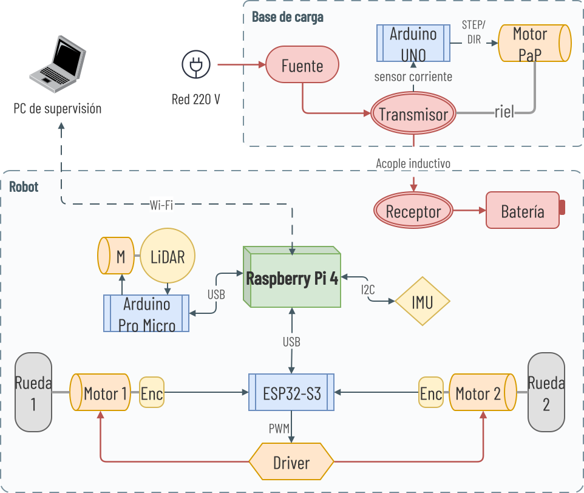

Trabajo de Graduación de Ingeniería Electrónica, Facultad de Ciencias Exactas y Tecnología, Universidad Nacional de Tucumán (Laboratorio de Técnicas Digitales).

## Repositorios

- [pablem/2025-LidarRobot](https://github.com/pablem/2025-LidarRobot): stack ROS 2 y repositorio principal.
- [pablem/2025-ros_ESP32S3_Motor_Controller](https://github.com/pablem/2025-ros_ESP32S3_Motor_Controller): firmware del controlador de motores (ESP32-S3).

## Diagrama general

## Etapa 1 · Fundamentos

- [Linux: introducción breve](./fundamentos/linux-introduccion.md): comandos y conceptos mínimos para moverse en la terminal.
- [ROS: introducción extendida](./fundamentos/ros-introduccion.md): nodos, topics, tf, arquitectura y herramientas.
- [Diccionario](./fundamentos/diccionario.md): referencia rápida de términos.

## Etapa 2 · Setup del host (RPi4)

- [Ubuntu y ROS: setup y configuración](./setup-rpi4/ubuntu-ros-setup.md): instalación del sistema y workspace.
- [Periféricos RPi4](./setup-rpi4/perifericos-rpi4.md): botón on/off, cooler y comunicación I²C.

## Etapa 3 · Control de motores

Documentado en el repositorio del firmware:

- [ESP32-S3: configuración y funciones](https://github.com/pablem/2025-ros_ESP32S3_Motor_Controller/blob/main/docs/esp32s3-configuracion.md): periféricos usados en el firmware (PWM, WiFi, BLE).
- [ESP32-S3: implementación del controlador de motores (ROS-bridge)](https://github.com/pablem/2025-ros_ESP32S3_Motor_Controller/blob/main/docs/controlador-motores.md): firmware, protocolo serial y módulos.
- [Diseño de controladores PI](https://github.com/pablem/2025-ros_ESP32S3_Motor_Controller/blob/main/docs/controladores-pi.md): identificación de planta y ajuste de ganancias.

## Etapa 4 · Odometría

- [Encoders incrementales](https://github.com/pablem/2025-ros_ESP32S3_Motor_Controller/blob/main/docs/encoders.md) y [AS5040: salida incremental A/B](https://github.com/pablem/2025-ros_ESP32S3_Motor_Controller/blob/main/docs/encoders-as5040.md): lectura por PCNT en el ESP32-S3.
- [IMU MPU-9250: driver y fusión EKF](./odometria/imu-mpu9250.md): orientación filtrada y fusión con encoders.
- [ros2_control y odometría](./odometria/ros2-control-odometria.md): interfaz hacia ROS y calibración del diferencial.

## Etapa 5 · Mapeo y navegación

- [LiDAR XV-11: hardware, firmware y driver ROS 2](./mapeo-navegacion/lidar-xv11.md): sensor láser de escaneo 2D.
- [SLAM: slam_toolbox](./mapeo-navegacion/slam-toolbox.md): construcción del mapa.
- [Navegación con Nav2](./mapeo-navegacion/nav2.md): stack de planificación y control.
- [Ajustes y observaciones durante la navegación](./mapeo-navegacion/ajustes-navegacion.md): diagnóstico y ajuste fino en navegación real.

## Etapa 6 · Energía

- [Baterías: pack Li-ion 4S](./energia/baterias.md)
- [Sensor de batería](./energia/sensor-bateria.md)
- [Base de carga](./energia/base-de-carga.md): carga inalámbrica con alineación automática.

## Etapa 7 · Aplicaciones

- [Exploración autónoma con explore_lite](./aplicaciones/explore-lite.md): reconocimiento del entorno por fronteras.

## Simulación

- [Simulaciones en Gazebo Fortress](./simulacion/gazebo-fortress.md)
- [Simulaciones en Windows con WSL2](./simulacion/windows-wsl2.md)
- [RViz2 en Windows con RoboStack mediante Pixi](./simulacion/rviz2-windows-robostack.md)
