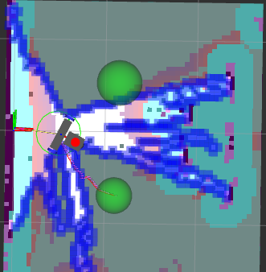
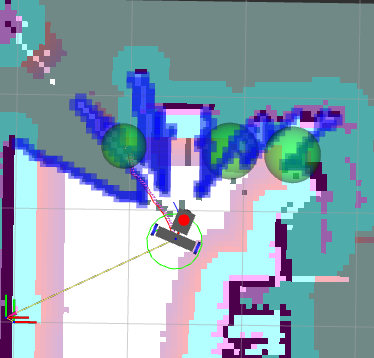

> [!NOTE]
> `explore_lite` realiza **exploración autónoma basada en fronteras**: una *frontera* es el límite entre el espacio libre y el espacio desconocido del mapa. El nodo busca todas las fronteras, elige la "mejor" por una función de costo y envía al robot un goal a esa frontera vía Nav2. Al llegar (o al crecer el mapa) re-evalúa y repite, hasta que no quedan fronteras → exploración terminada.

| Parámetro | Valor |
| --- | --- |
| Algoritmo | Exploración por fronteras (m-explore-ros2) |
| Parámetros | potential 4.0 > gain 1.3, min_frontier 0,9 m, 1 evaluación cada 10 s |
| Misión | Undock en lazo abierto 0,40 m → exploración → retorno → dock → guardado del mapa |
| Retorno | Por tiempo (180 s), inactividad (60 s) o batería (< 14 V) |

## Referencias

- [GitHub - robo-friends/m-explore-ros2 (feature/slam_toolbox_compat)](https://github.com/robo-friends/m-explore-ros2/tree/feature/slam_toolbox_compat)
- [explore_lite - ROS Wiki](https://wiki.ros.org/explore_lite)
- [navigation2/nav2_simple_commander (humble)](https://github.com/ros-navigation/navigation2/tree/humble/nav2_simple_commander)
- [Simple Commander API — Nav2](https://docs.nav2.org/commander_api/index.html#simple-commander-api)

## Idea general

`explore_lite` **no mantiene un mapa propio**: consume el `OccupancyGrid` de SLAM/Nav2 y delega toda la navegación y evitación de obstáculos a Nav2. En ROS 2 (`m-explore-ros2`) ya no usa la acción `move_base` de ROS 1, sino que se integra directamente con **Nav2** vía la acción `NavigateToPose` y con **`slam_toolbox`** como fuente del mapa.

```
SLAM/Nav2 (/map) ──► Costmap2DClient ──► FrontierSearch ──► Explore.makePlan()
                                                                  │
                                                                  ▼
                                                    NavigateToPose (action) ──► Nav2
```

## Conceptos clave

- **Frontera**: borde entre espacio libre (`FREE_SPACE`) y espacio desconocido (`NO_INFORMATION`) en el `OccupancyGrid`.
- **Función de costo**: decide qué frontera visitar primero, ponderando cercanía contra tamaño.
- **Blacklist**: fronteras que Nav2 no logró alcanzar; se descartan temporalmente.
- **Delegación a Nav2**: explore_lite solo *elige a dónde ir*; Nav2 planifica y evita obstáculos.

## Tres componentes

### 1. `Costmap2DClient` — adaptador de mapa (`namespace explore`)

Suscribe al mapa y lo mantiene en un `nav2_costmap_2d::Costmap2D` local thread-safe, que `FrontierSearch` puede leer mientras se actualiza en paralelo.

- **Constructor bloqueante**: espera (a) el primer mensaje del costmap y (b) el transform `global_frame → robot_base_frame` en TF. De ahí el log `Waiting for costmap to become available, topic: map` (~6 s, lo que tarda Nav2 en publicar el primer costmap; arranca con `TimerAction(5s)` en `slam_nav.launch.py`).
- **Suscripciones**: `costmap_topic` (`map`, `OccupancyGrid`, callback `updateFullMap`) y `costmap_updates_topic` (`map_updates`, `OccupancyGridUpdate`, callback `updatePartialMap`). El frame global se toma del header del primer mensaje.
- `updateFullMap` redimensiona y copia todo pasando por la tabla de traducción de valores. Cada resize aparece como `StaticLayer: Resizing costmap to X x Y` en los logs de Nav2.
- `getRobotPose()` transforma `base_link → global_frame` vía TF. Si falla (Lookup/Connectivity/Extrapolation) retorna pose vacía → `searchFrom` falla con "Robot out of costmap bounds".

### 2. `FrontierSearch` — búsqueda y ranking (`namespace frontier_exploration`)

`searchFrom(position)`:

```
1. Verifica que el robot esté dentro del costmap.
2. Lock del mutex del costmap (thread-safe).
3. BFS 4-conectado desde la celda libre más cercana al robot, visitando FREE_SPACE.
   Si una vecina es NO_INFORMATION con ≥1 vecino FREE_SPACE → celda fronteriza
   → buildNewFrontier() (BFS 8-conectado que expande la frontera completa).
4. Descarta fronteras con  size × resolution < min_frontier_size.
5. Calcula costo de cada frontera y ordena ascendente (menor costo = mejor).
```

La estructura `Frontier` contiene `size`, `min_distance`, `cost`, `initial`, `centroid`, `middle` (punto más cercano al robot) y `points`. **El goal enviado a Nav2 es `frontier.centroid`.**

**Función de costo** (clave para el comportamiento):

```
cost = potential_scale × min_distance × resolution    (penaliza fronteras lejanas)
     − gain_scale      × size         × resolution    (premia fronteras grandes)
```

La relación `potential_scale` vs `gain_scale` decide si el robot prefiere fronteras **cercanas** (potential > gain) o **grandes/lejanas** (gain > potential). Ver la config del proyecto y su justificación más abajo.

### 3. `Explore` — nodo orquestador (`namespace explore`, `rclcpp::Node`)

Ciclo `makePlan()` (cada `1/planner_frequency` s):

```
makePlan()
  ├─ getRobotPose()                         pose actual
  ├─ searchFrom(pose)                       fronteras ordenadas por costo
  ├─ sin fronteras → stop(finished) → returnToInitialPose() si return_to_init
  ├─ filtra fronteras en blacklist
  ├─ mismo goal sin progreso > progress_timeout → blacklist → re-makePlan()
  ├─ mismo goal con progreso → espera
  └─ goal nuevo → async_send_goal(navigate_to_pose) → reachedGoal()
```

`reachedGoal`: `SUCCEEDED` → `makePlan()` inmediato; `ABORTED` → blacklistea el goal; `CANCELED` → no re-planifica (pausado externamente).

**Blacklist**: se agrega una frontera si Nav2 aborta o si vence `progress_timeout` sin avance. `goalOnBlacklist()` compara con tolerancia de 5 celdas × resolución. Vive en memoria, no se persiste entre sesiones.

**Control externo** (topic `explore/resume`, `std_msgs/Bool`):

```bash
ros2 topic pub /explore/resume std_msgs/msg/Bool "data: false" --once   # pausar
ros2 topic pub /explore/resume std_msgs/msg/Bool "data: true"  --once   # reanudar
```

Al reanudar, `resuming_` evita un blacklist inmediato por `progress_timeout`.

## Topics y actions

| Nombre | Tipo | Dir | Descripción |
| --- | --- | --- | --- |
| `map` (`costmap_topic`) | `OccupancyGrid` | sub | Costmap que consume `Costmap2DClient` |
| `map_updates` | `OccupancyGridUpdate` | sub | Actualizaciones parciales |
| `explore/resume` | `std_msgs/Bool` | sub | `true` reanuda, `false` pausa |
| `explore/status` | `explore_lite_msgs/ExploreStatus` | pub | Estado (QoS transient_local) |
| `explore/frontiers` | `visualization_msgs/MarkerArray` | pub | Markers RViz (si `visualize: true`) |
| `navigate_to_pose` | `nav2_msgs/action/NavigateToPose` | action client | Goals a Nav2 |

## Tabla de traducción de valores del costmap

`Costmap2DClient` mapea `OccupancyGrid` (-1..100) → valores internos de `nav2_costmap_2d` (0..255). `FrontierSearch` opera sobre los valores internos:

| OccupancyGrid | Interno | Significado |
| --- | --- | --- |
| 0 | 0 (`FREE_SPACE`) | Libre |
| 1–98 | 2–252 | Ocupado parcial |
| 99 | 253 (`INSCRIBED`) | Inscribed obstacle |
| 100 | 254 (`LETHAL`) | Obstáculo letal |
| -1 (255) | 255 (`NO_INFORMATION`) | Desconocido |

## Configuración del proyecto (`explore/config/params.yaml`)

```yaml
ros__parameters:
  robot_base_frame: base_link
  return_to_init: false          # el retorno lo administra return_to_base.py
  costmap_topic: map             # mapa crudo de slam_toolbox, no el costmap inflado
  costmap_updates_topic: map_updates
  visualize: true                # publica fronteras en /explore/frontiers para RViz

  planner_frequency: 0.10        # Hz — 10 s entre evaluaciones
  progress_timeout: 110.0        # s sin avance → blacklist del goal
  transform_tolerance: 0.3

  potential_scale: 4.0           # penaliza distancia (prefiere fronteras cercanas)
  gain_scale: 1.3                # premia fronteras grandes
  min_frontier_size: 0.9         # descarta aberturas donde el robot no entra y bordes del mapa
```





> [!NOTE]
> **Por qué `potential > gain` a propósito:** con `gain_scale` dominante el robot apuntaba a fronteras grandes lejanas a través de obstáculos aún no mapeados. Prefiriendo fronteras cercanas explora de forma incremental y mapea el camino antes de avanzar.

## Retorno a base, undock y dock

En este robot `return_to_init` está en `false`: el retorno a `odom(0,0,0)` lo maneja el script `return_to_base.py` (suscrito a `/navigate_to_pose/_action/status` para detectar inactividad al terminar la exploración). Adicionalmente, la salida y entrada a la base de carga **no las resuelve Nav2**.

> [!NOTE]
> El robot vive sobre una base de carga adosada a una pared, así que la primera y última pose del ciclo son ciegas para Nav2: al hacer **undock** arranca pegado a la pared con el costmap inflado encima suyo (cualquier `NavigateToPose` rechaza el plan), y en el **dock final** la pose exacta cae sobre la pared inflada. Ambos tramos necesitan una maniobra recta, *open-loop*, sin chequeo de costmap.

El lazo abierto publica `Twist` crudo en `cmd_vel` (vía `twist_mux`, prioridad navigation) durante un tiempo calculado (`dist/speed`), ignorando el costmap, de modo que siempre sale/entra del dock. `twist_mux` se republica a `publish_rate = 20 Hz` por el timeout que impone el control manager.

| Parámetro | Default | Descripción |
| --- | --- | --- |
| `undock_dist` | 0.40 m | Distancia a avanzar para salir del dock |
| `undock_speed` | 0.10 m/s | Velocidad de la maniobra |
| `startup_delay` | 1.0 s | Espera a que `twist_mux`/controller estén listos |
| `publish_rate` | 20 Hz | Republicación del Twist (timeout twist_mux 0.5 s) |

**Calibración del `dock_yaw_offset`:** tras un ciclo completo, medir el yaw final y compensar con el signo opuesto.

```bash
ros2 run tf2_ros tf2_echo map base_link
```

### Parámetros de la misión (`robot/launch/explore.launch.py`)

| Parámetro | Valor | Descripción |
| --- | --- | --- |
| `exploration_time` | 180 s | Duración máxima de la exploración |
| `idle_timeout` | 60 s | Tiempo sin goals activos → retorno |
| `battery_threshold` | 14 V | Tensión del pack que dispara retorno anticipado |
| `undock_dist` | 0,40 m | Avance de salida de la base |
| `dock_x_offset` | 0,40 m | Goal de retorno: distancia delante de la base |
| `dock_reverse_dist` | 0,50 m | Retroceso final de acoplamiento |
| `undock_speed` / `dock_speed` | 0,10 m/s | Velocidad de ambas maniobras |
| `dock_yaw_offset` | 0,0 rad | Compensación de rumbo (por calibración) |
| `map_dir` / `map_base_name` | — | Destino del mapa serializado al terminar |

`return_to_base.py` dispara el retorno por **tiempo cumplido**, **inactividad** o **batería baja**; pausa el explorador (`/explore/resume false`), navega al goal de dock, ejecuta el acople y serializa el mapa.

Si el yaw medido es `-0.10 rad`, setear `dock_yaw_offset: 0.10` en `explore.launch.py`. Promediar 2-3 corridas; si el desvío no es repetible, no compensa calibrarlo. Undock y dock son simétricos (se ejecutan con carga de batería similar), así que sus desvíos se mueven parejos y en gran medida se cancelan.

## Flujo de trabajo

Con el robot sobre su base:

```bash
# Terminal 1 (robot): hardware, controladores, láser, IMU, twist_mux
ros2 launch robot launch_robot.launch.py

# Terminal 2 (robot): SLAM + Nav2
ros2 launch robot slam_nav.launch.py

# Terminal 3 (robot): misión completa (undock → exploración → retorno → dock → guardado de mapa)
ros2 launch robot explore.launch.py
```

Compilar el explorador (una vez):

```bash
colcon build --packages-select explore_lite_msgs explore_lite --symlink-install
```

El costmap global usa `track_unknown_space: true`.

## Notas de operación

- Las paradas frecuentes (~3 s) son normales: explore_lite actualiza su goal cuando el mapa crece y aparece una frontera mejor.
- `BehaviorTree tick rate exceeded` en Raspberry Pi es esperado bajo carga; no afecta la navegación.
- Ctrl+C cancela el goal en curso limpiamente.
- En una sesión corta el costmap creció de 64×108 a 113×127 celdas (0.05 m/px), mapeando ~5.6×6.4 m.

> [!NOTE]
> Los parámetros de Nav2 y `slam_toolbox` que afectan el comportamiento durante la exploración (costmap, scan matching, latencia del XV-11) están en [Navegación con Nav2](../mapeo-navegacion/nav2.md), sección *Ajustes derivados de la experimentación*.

## Referencias

- [github.com/robo-friends/m-explore-ros2/tree/feature/slam_toolbox_compat](https://github.com/robo-friends/m-explore-ros2/tree/feature/slam_toolbox_compat)
- [wiki.ros.org/explore_lite](https://wiki.ros.org/explore_lite)
- [github.com/ros-navigation/navigation2/tree/humble/nav2_simple_commander](https://github.com/ros-navigation/navigation2/tree/humble/nav2_simple_commander)
- [docs.nav2.org/commander_api/index.html#simple-commander-api](https://docs.nav2.org/commander_api/index.html#simple-commander-api)
