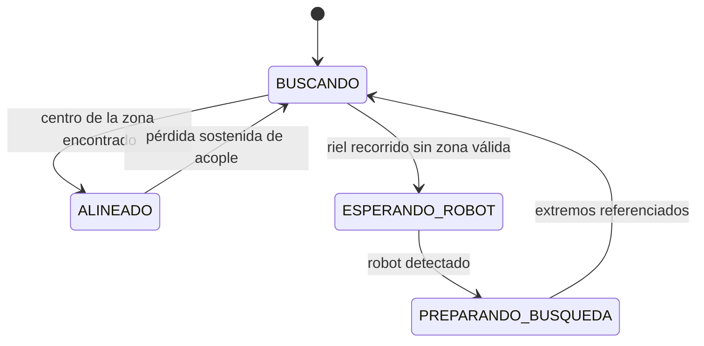

> [!NOTE]
> Estación de carga inalámbrica por acoplamiento inductivo. La base desplaza horizontalmente la bobina transmisora hasta alinearla con la receptora del robot, usando la corriente del transmisor como referencia.

| Parámetro | Valor |
| --- | --- |
| Tipo | Carga inalámbrica inductiva |
| Fuente | 24 V / 240 W |
| Transmisor | Bobina TX móvil sobre husillo (NEMA 17 + A4988 + Arduino UNO) |
| Alineación | Por corriente del ACS712 (entra > 0,45 A, sale < 0,35 A) |
| Receptor | XL4016E1 a ~16,2 V / 1,5 A → 1N5822 → BMS 4S |

> [!NOTE]
> [FIGURA PENDIENTE — Fig. I.4 del informe: esquema de base de carga, control de posición, transmisor y receptor]

## Estación (transmisor)

- Fuente switching 220 Vca → **24 Vcc, 10 A (240 W)**.
- Rama de potencia: 24 V → sensor **ACS712-05B** (en serie) → módulo transmisor → bobina TX.
- Rama de control: 24 V → DC-DC **XL4016** ajustado a **5 V** → Arduino UNO + CNC Shield + driver **A4988** → motor **NEMA 17**.
- Filtrado en la línea de 5 V: electrolítico 1000 µF / 10 V / 105 °C ∥ cerámico 100 nF / 50 V (permite prescindir del USB).
- Mecánica: NEMA 17 → acople flexible → husillo → carro con la bobina TX. Finales de carrera en ambos extremos. Todo dentro de una caja estanca plástica.

## Robot (receptor)

- Bobina + módulo receptor → ~24 Vcc.
- DC-DC **XL4016E1** con regulación de tensión y corriente: **~16,2 V, límite 1,5 A** (carga conservadora).
- Diodo Schottky **1N5822** en serie: evita que el pack alimente al DC-DC cuando el robot se retira.
- **BMS 4S 40 A** con balanceo (carga continua hasta 20 A).
- Pack **4S1P** de celdas 18650 Li-ion (16,8 V máx. teórico).

## Algoritmo de alineación

- Corriente promediada sobre varias lecturas del ACS712.
- Entrada a la zona de acople: **I > 0,45 A** en 3 lecturas consecutivas.
- Salida de la zona: **I < 0,35 A** (histéresis).
- Avance en bloques de **100 micropasos**; se cuentan los pasos dentro de la zona y se retrocede la mitad → bobina en el centro.
- Sin zona válida tras recorrer el riel: la bobina queda en el centro y espera al robot.

## Puesta en marcha

1. Compilar y cargar desde Arduino IDE sobre el Arduino UNO.
2. Monitor serie a **115200 baudios** para ver estado y corriente.
3. Calibrar la constante `CERO_ADC` con la lectura del sensor a corriente nula.

## Ensayos

> [!NOTE]
> [FIGURA PENDIENTE — registro de corriente de un ciclo de búsqueda (§5.11.1, figura sin número en el informe)]

> [!NOTE]
> [FIGURA PENDIENTE — curvas de carga y descarga del pack (§5.11.2–5.11.3)]
- Ciclo automático verificado: aproximación → alineación → carga; al retirarse el robot la estación vuelve a buscar.
- Datos de carga/descarga: [pendientes en el informe].
- La maniobra del robot para entrar y salir de la base está en [Exploración Autónoma con explore_lite](../aplicaciones/explore-lite.md).
