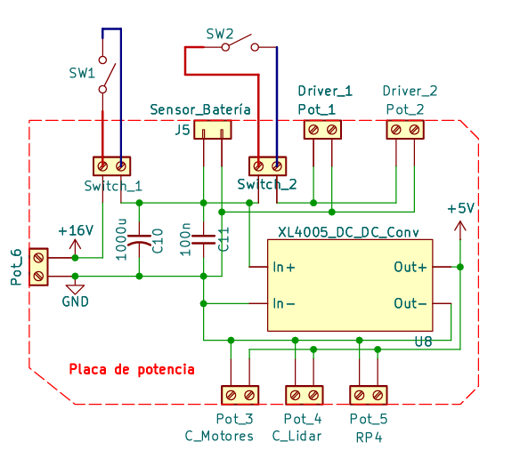

> [!IMPORTANT]
> **Pack definitivo: Li-ion 4S.** Las LiPo 3S fueron provisorias; su documentación se conserva debajo como versión anterior.

| Parámetro | Valor |
| --- | --- |
| Pack | Li-ion 4S (14,8 V nom., 16,8 V máx.) con BMS 4S |
| Medición | ADC del ESP32-S3, divisor 22k/3,3k (comando `b`) |
| Retorno a base | Bajo 14 V |
| Versión anterior | LiPo Turnigy 3S (1300/2200 mAh), provisorias |

## Pack final: Li-ion 4S

- 4 celdas 18650 en serie (4S1P): **14,8 V nominal, 16,8 V máx.** Dos juegos de 2200 mAh, 30C.
- Protección y balanceo: **BMS 4S 40 A** (ver [Base de carga](./base-de-carga.md)).
- Carga inalámbrica a ~16,2 V / 1,5 A máx.

### Sensado de tensión (ESP32-S3)

- Divisor resistivo **R1 = 22 kΩ, R2 = 3,3 kΩ** → ADC1 del ESP32-S3 (16,8 V → ~2,0 V, dentro del rango lineal 150–2450 mV; R_Th ≈ 2,9 kΩ < 10 kΩ).
- Se lee con el comando `b` del protocolo serie (promedio de 16 muestras):

```cpp
case GET_BATTERY: // "b"
{
  int32_t sumMv = 0;
  for (int i = 0; i < 16; i++) sumMv += analogReadMilliVolts(BATTERY_SENSE);
  float voltage = (sumMv / 16.0f) * BATTERY_FACTOR / 1000.0f;
  Serial.println(voltage, 1);
  break;
}
```

- Ruido observado con encoders activos: +0,28 V de offset y ±0,13 V; se mitigó con desacople de 100 nF + 10 µF en la alimentación de los encoders.
- En ROS: parámetros `battery_voltage_min: 12.0`, `battery_voltage_max: 16.8` en `ros2_control.xacro`. Umbral de retorno a base: 14 V.

### Interruptores

- **General:** corta toda la alimentación.
- **Emergencia (frente):** corta sólo la etapa de potencia.
- **Pulsador de apagado:** apagado ordenado del SO (ver [Periféricos RPi4](../setup-rpi4/perifericos-rpi4.md)).



---

<details>
<summary>Versión anterior: LiPo 3S (provisoria)</summary>

> [!NOTE]
> Durante el desarrollo se usaron dos paquetes LiPo Turnigy 3S (11,1 V nominales, 30C de descarga): una de 1300 mAh y otra de 2200 mAh (formato Shorty). Ambas se cargan a 4,2 V/celda, se almacenan entre 3,7 y 3,85 V/celda, y nunca deben descargarse por debajo de 3,0 V/celda.

> [!WARNING]
> Estas baterías se utilizaron durante las pruebas del proyecto pero no forman parte del robot entregable, ya que serán reemplazadas por otras.

### ¿Qué es una batería LiPo?

[Blog - LiPo Battery Safety and Optimization Guide | HobbyKing](https://hobbyking.com/blog/lipo-battery-safety-storage-discharge-guide)

LiPo (Lithium Polymer) es una variante de la familia de baterías de ion-litio que utiliza un electrolito polimérico en lugar de líquido, lo que permite empaquetarlas en formato *soft pouch* (bolsa flexible). Esta construcción las hace livianas y con alta densidad de energía, a costa de ser mecánicamente frágiles y químicamente menos estables que otras químicas. Tienen la capacidad de entregar corrientes altas.

Cada celda tiene una tensión nominal de 3,7 V y un rango operativo entre 3,0 V (corte) y 4,2 V (carga plena). Una batería 3S (tres celdas en serie) entrega entonces 11,1 V nominales y 12,6 V a plena carga.

### Paquetes utilizados en el proyecto

| Especificación | Turnigy 1300 mAh 3S 30C | Turnigy 2200 mAh 3S 30C Shorty |
| --- | --- | --- |
| Tensión nominal | 11,1 V | 11,1 V |
| Capacidad | 1300 mAh | 2200 mAh |
| C-rate descarga | 30C | 30C |
| Corriente máx. descarga | 30 × 1,3 A = 39 A | 30 × 2,2 A = 66 A |
| C-rate carga | 2C | 1C |
| Corriente máx. carga | 2 × 1,3 A = 2,6 A | 1 × 2,2 A = 2,2 A |

> [!TIP]
> Si la etiqueta no especifica el C-rate de carga, asumir 1C (carga conservadora). Cargar a tasas más altas reduce la vida útil del pack.

### Valores clave de operación (datasheet resumida)

| Parámetro | Valor | Observación |
| --- | --- | --- |
| Tensión máxima de carga  | 4,2 V | 12,6 V para 3S |
| Tensión de corte mínima | 3,3 – 3,5 V | configurar alarma audible en 3,6 V |
| Tensión de daño irreversible | 3,0 V | daño permanente |
| Tensión de almacenamiento | 3,7 – 3,85 V | más de 1–2 días |
| Rango de temperatura de operación | 4 – 49 °C | fuera de este rango se acelera la degradación |
| Verificación periódica de tensión | Cada 6 meses (mínimo) | recomendado: cada 1 mes |

> [!WARNING]
> Una LiPo en fuga térmica puede despedir gas inflamable y prenderse fuego. Mantener arena seca o un extintor ABC cerca del puesto de carga, y nunca intentar mover un pack que esté humeando o caliente al tacto.

### Recursos

- [HobbyKing – Turnigy 1300 mAh 3S 30C](https://hobbyking.com/es_es/turnigy-1300mah-3s-30c-lipo-pack.html)
- [HobbyKing – Turnigy 2200 mAh 3S 30C Shorty (XT60)](https://hobbyking.com/es_es/turnigy-2200mah-3s-11-1v-30c-shorty-lipo-battery-pack-w-xt60.html)
- [HobbyKing Blog – LiPo Battery Safety and Optimization Guide](https://hobbyking.com/blog/lipo-battery-safety-storage-discharge-guide)
- [Gens Tattu – LiPo Battery Guide](https://www.genstattu.com/bw/)
- [HobbyKing – Battery Learning Hub](https://hobbyking.com/battery-learning-hub)

</details>

## Referencias

- [hobbyking.com/es_es/turnigy-1300mah-3s-30c-lipo-pack.html](https://hobbyking.com/es_es/turnigy-1300mah-3s-30c-lipo-pack.html)
- [hobbyking.com/es_es/turnigy-2200mah-3s-11-1v-30c-shorty-lipo-battery-pack-w-xt60.html](https://hobbyking.com/es_es/turnigy-2200mah-3s-11-1v-30c-shorty-lipo-battery-pack-w-xt60.html)
- [hobbyking.com/blog/lipo-battery-safety-storage-discharge-guide](https://hobbyking.com/blog/lipo-battery-safety-storage-discharge-guide)
- [genstattu.com/bw](https://www.genstattu.com/bw/)
- [hobbyking.com/battery-learning-hub](https://hobbyking.com/battery-learning-hub)
