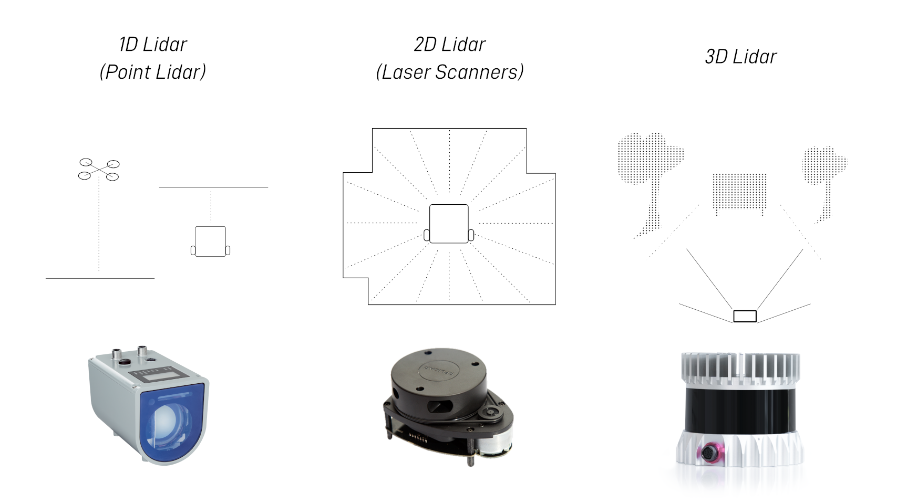
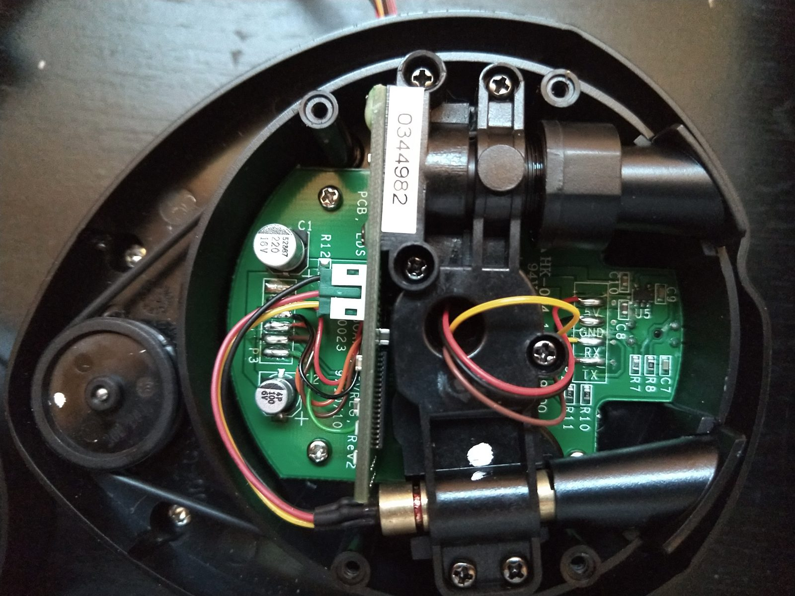
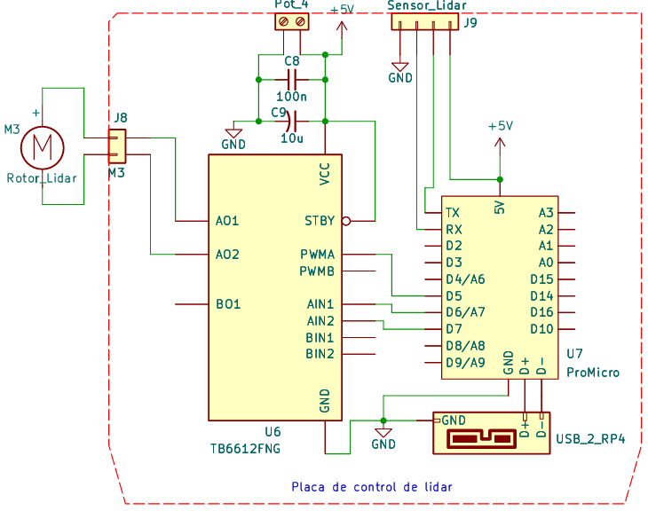
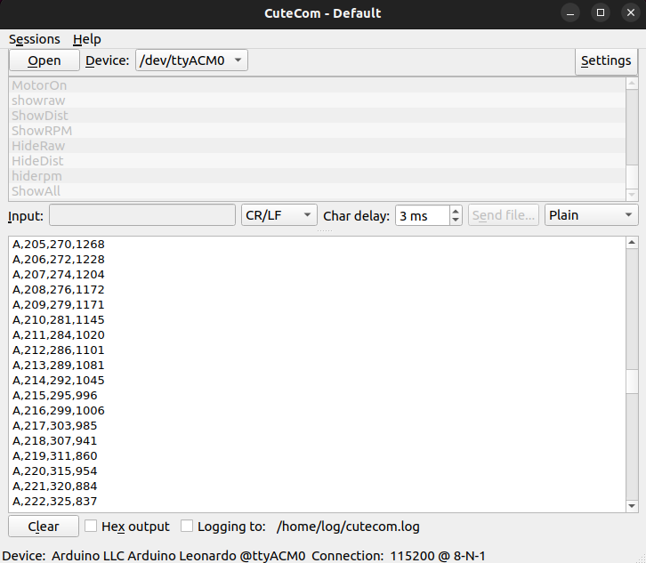
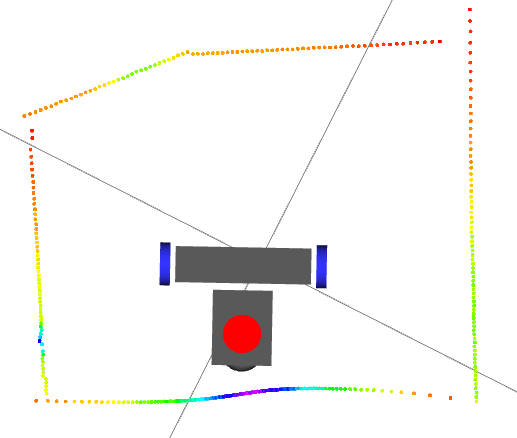

> [!NOTE]
> El Neato XV-11 es el sensor LiDAR que provee los escaneos de obstáculos al stack de navegación y SLAM. Se usa sin su placa original de control y decodificación: opera a 115200 baudios y genera 360 lecturas por revolución, con un rango de 0,15 a 5 m.

| Parámetro | Valor |
| --- | --- |
| Lecturas por vuelta | 360 |
| Puerto serie | 8N1 a 3,3 V, 115200 baudios |
| Rango de medición | 0,15 – 5 m |
| Controlador | Arduino Pro Micro + TB6612FNG ([XV_Lidar_Controller](https://github.com/getSurreal/XV_Lidar_Controller)) |
| PID de velocidad | Setpoint 280 rpm, Kp = 2, Ki = 1 |
| Driver ROS 2 | `xv_11_laser_driver` (fork Humble), frame `laser_frame` |

## ¿Qué es un LiDAR?

LiDAR son las siglas de *Light Detection And Ranging*, análogo al sonar (*SOund NAvigation and Ranging*) y al radar (*RAdio Detection And Ranging*), pero usando haces de luz para medir la distancia a objetos. Esto permite al robot sensar su entorno y construir un mapa local del espacio que lo rodea. Existen tres categorías principales: 1D ("cinta métrica digital"), 2D (*laser scanners*) y 3D (retornan una imagen con distancia por píxel).



*Tipos de LiDAR. Fuente: [Articulated Robotics](https://articulatedrobotics.xyz/tutorials/mobile-robot/hardware/lidar).*

> [!TIP]
> Este proyecto usa un LiDAR 2D.

## LiDAR en ROS 2

ROS tiene soporte nativo para LiDARs. El principal beneficio es la abstracción de protocolo: independientemente del fabricante o modelo, si existe un driver ROS para ese sensor, publica en un formato estándar, `sensor_msgs/LaserScan`. Cada mensaje contiene un array de distancias (en metros) correspondiente a un barrido completo del sensor, más los parámetros para interpretar el ángulo de cada medición.

Cada mensaje `LaserScan` lleva el nombre del frame TF al que está anclado el sensor (en este proyecto, `laser_frame`). TF2 usa ese dato para transformar las distancias al frame del robot y permitir que SLAM fusione los escaneos con la odometría.

## Neato XV-11: documentación corta

Basada en [ssloy/neato-xv11-lidar](https://github.com/ssloy/neato-xv11-lidar).

### Velocidad del motor

1. El motor puede conectarse a 3,3 V (aprox. 60 mA), lo que produce una velocidad de 240 rpm con el sensor limpio y libre de obstrucciones.
2. Con firmware V2.4 y V2.6, el sensor debe girar entre 180 y 349 rpm: por encima se pierden paquetes y por debajo no se envían.
3. Por encima de 320 rpm los datos se vuelven escasos (sólo uno de cada dos datos contiene información válida).

### Versiones de hardware

Existen al menos dos versiones principales de hardware. Para identificar la disponible, se abre la parte superior del sensor y se verifica qué indica la bornera del cable rojo de alimentación (distinta de la alimentación del motor DC).

| Versión | Consumo (sin motor) | Rojo | Marrón | Naranja | Negro |
| --- | --- | --- | --- | --- | --- |
| 3,3 V (antigua, poco común) | ~145 mA | +3,3 V | LDS_RX | LDS_TX | GND |
| 5 V (mayoría de unidades y modelos nuevos) | ~45 mA detenido, ~135 mA en uso | +5 V | LDS_RX | LDS_TX | GND |

> [!IMPORTANT]
> En todas las versiones, la comunicación es por puerto serie 8N1 a **3,3 V** y 115200 baudios. El conector es un JST PH de 2,0 mm y 4 pines.



*Identificación del sensor: alimentación de 5 V (versión más reciente).* [INCIERTO: fuente de la foto]

### Protocolo serial (firmware v2.6)

Trama 8N1: `{start "0"} {data 8 bits (LSB a MSB)} {stop "1"}`.

1. A velocidad nominal se envían 90 paquetes por revolución.
2. Cada paquete tiene 22 bytes y contiene 4 lecturas consecutivas, lo que acumula 360 lecturas por vuelta (90 · 22 · 10 = 19 800 bits físicos por vuelta).
3. Estructura del paquete:

```text
<start> <index> <speed_L> <speed_H> [Data 0] [Data 1] [Data 2] [Data 3] <checksum_L> <checksum_H>
```

| Campo | Descripción |
| --- | --- |
| `start` | Siempre `0xFA` |
| `index` | Índice del paquete dentro de la vuelta: de `0xA0` (paquete 0, lecturas 0–3) a `0xF9` (paquete 89, lecturas 356–359) |
| `speed` | 2 bytes *little-endian*, en 1/64 rpm (punto fijo con 6 bits de parte decimal) |
| `Data 0..3` | 4 lecturas de 4 bytes cada una (ver abajo) |
| `checksum` | 2 bytes, calculado sobre los primeros 20 bytes del paquete |

Cada lectura se organiza así:

```text
byte 0 : <distance 7:0>
byte 1 : <"invalid data" flag> <"strength warning" flag> <distance 13:8>
byte 2 : <signal strength 7:0>
byte 3 : <signal strength 15:8>
```

- La distancia está en mm, codificada en 14 bits.
- **Bit 7 del byte 1** (*invalid data*): no se pudo calcular la distancia y el byte 0 contiene un código de error (por ejemplo `0x02`, `0x03`, `0x21`, `0x25`, `0x35` o `0x50`). En ese caso todo el bloque es inválido.
- **Bit 6 del byte 1** (*strength warning*): la intensidad es muy inferior a la esperada para esa distancia. Ocurre con materiales de baja reflectancia (negros), puntos de forma o tamaño inesperados (materiales porosos, tela transparente, rejillas, bordes) o reflejos parásitos.
- **Bytes 2 y 3**: LSB y MSB de la intensidad de la señal. Puede ser muy alta frente a un espejo.

Algoritmo del checksum:

```python
def checksum(data):
    """Compute and return the checksum as an int."""
    # group the data by word, little-endian
    data_list = []
    for t in range(10):
        data_list.append( data[2*t] + (data[2*t+1]<<8) )
    # compute the checksum on 32 bits
    chk32 = 0
    for d in data_list:
        chk32 = (chk32 << 1) + d
    # return a value wrapped around on 15bits, and truncated to still fit into 15 bits
    checksum = (chk32 & 0x7FFF) + ( chk32 >> 15 ) # wrap around to fit into 15 bits
    checksum = checksum & 0x7FFF # truncate to 15 bits
    return int( checksum )
```

<details>
<summary>Opcional: ver la identificación del sensor con <code>screen</code></summary>

```bash
sudo apt install screen
screen /dev/ttyUSB0 115200
```

Al conectar el sensor sin hacer girar el motor, imprime su identificación:

```text
Piccolo Laser Distance Scanner
Copyright (c) 2009-2011 Neato Robotics, Inc.
All Rights Reserved

Loader  V2.5.15295
CPU     F2802x/c001
Serial  WTD49312AA-0205890
LastCal [5371726C]
Runtime V2.6.15295
```

La línea `Runtime` confirma que el firmware principal es la versión 2.6, en la que se basa esta guía.

</details>

<details>
<summary>Opcional: visualizar datos crudos sin ROS (ssloy)</summary>

Script en C++ para ver los datos crudos en la terminal:

```bash
git clone https://github.com/ssloy/neato-xv11-lidar.git
cd neato-xv11-lidar
g++ xv11.cpp -o lidar_viewer
./lidar_viewer
```

Salida de ejemplo:

```text
angle: 321    distance: 2761
angle: 323    distance: 2629
#rpm: 276.359
angle: 324    distance: 2697
```

También existe una versión con interfaz gráfica, no explorada en este proyecto: [Xevel/NXV11](https://github.com/Xevel/NXV11).

</details>

## Controlador en Arduino (control de giro y comunicación)

Al no incluir una placa como las versiones comerciales, fue necesario desarrollar un prototipo que decodifique la trama del sensor, controle el motor por línea de comandos e implemente un control PID de velocidad. Este controlador se comunica con el nodo driver oficial de ROS, adaptado luego a ROS 2.

Siguiendo los tutoriales de la documentación oficial ([conexión del XV-11 por USB](https://wiki.ros.org/xv_11_laser_driver/Tutorials/Connecting%20the%20XV-11%20Laser%20to%20USB) y [ejecución del nodo](https://wiki.ros.org/xv_11_laser_driver/Tutorials/Running%20the%20XV-11%20Node)), la única opción de firmware que cumplía todos los requerimientos fue [getSurreal/XV_Lidar_Controller](https://github.com/getSurreal/XV_Lidar_Controller).

`XV_Lidar_Controller` recibe los datos seriales del sensor, decodifica la velocidad en rpm y regula la velocidad con un controlador PID (200 a 300 rpm). Los datos del LiDAR se retransmiten por USB para que el host (Raspberry Pi 4) los procese.

### Placa de desarrollo del controlador

- **Arduino Pro Micro (Leonardo)**: basado en ATmega32U4. A diferencia del Uno, tiene USB nativo y un UART por hardware (`Serial1`) libre para el sensor, mientras que `Serial` (USB) se usa exclusivamente para la comunicación con la Raspberry Pi 4.
- **TB6612FNG**: driver de motor DC de doble canal (hasta 1,2 A continuos). Se controla con dos pines de dirección (IN1/IN2) y un pin PWM (STBY activo en alto). Se usa un solo canal para el motor de giro del LiDAR.
- **PID de velocidad**: el firmware extrae el campo `speed` de cada paquete (2 bytes *little-endian*, en 1/64 rpm), calcula el error respecto al setpoint (**280 rpm**) y ajusta el ciclo de trabajo del PWM del TB6612FNG.



*Esquemático de conexiones: Pro Micro, TB6612FNG, motor del rotor y conector del sensor.*

### Configuración en el código

Valores adoptados: **setpoint = 280 rpm; Kp = 2, Ki = 1, Kd = 0**. Período del PID: 20 ms. PWM con TimerThree (período de 30 µs, ~32,8 kHz).

```cpp
// Inicialización
rpmPID.SetOutputLimits(xv_config.pwm_min, xv_config.pwm_max);
rpmPID.SetSampleTime(xv_config.sample_time); // 20 ms
rpmPID.SetTunings(xv_config.Kp, xv_config.Ki, xv_config.Kd);

// Loop: sólo escribe el PWM si cambió
if (xv_config.motor_enable) {
  rpmPID.Compute();
  if (pwm_val != pwm_last) {
    Timer3.pwm(xv_config.motor_pwm_pin, pwm_val);
    pwm_last = pwm_val;
  }
  motorCheck();
}
```

### Comandos por USB (115200 baudios)

| Comando | Función |
| --- | --- |
| `ShowConfig` / `SaveConfig` / `ResetConfig` | Ver, guardar en EEPROM o restaurar la configuración |
| `SetRPM` / `MotorOn` / `MotorOff` | Consigna de velocidad (180–349 rpm), habilitar o detener el motor |
| `ShowRaw` / `HideRaw` | Habilitar o inhibir la trama cruda hacia USB |
| `ShowDist` / `ShowRPM` / `ShowErrors` | Distancias, velocidad y errores en CSV |
| `SetKp` / `SetKi` / `SetKd` / `SetSampleTime` | Ganancias y período (ms) del PID en tiempo de ejecución |



*Envío de comandos y lectura de distancias en CSV con CuteCom.*

## Driver ROS 2 (fork Humble)

El driver oficial ([rohbotics/xv_11_laser_driver](https://github.com/rohbotics/xv_11_laser_driver)) fue escrito para ROS 1 Noetic. Para Humble se lo modificó y se incluye en el repositorio del proyecto:

```bash
# Instalar dependencias
sudo apt update
sudo apt install -y libboost-all-dev

# Clonar y compilar
git clone https://github.com/pablem/2025-LidarRobot
cd ~/robotLidar
colcon build --symlink-install

# Limpiar builds previas si es necesario
rm -rf build/ install/ log/
```

### Ejecutar el nodo publicador

```bash
source install/setup.bash
ros2 run xv_11_laser_driver neato_laser_publisher \
  --ros-args -p port:=/dev/serial/by-id/usb-Arduino_LLC_Arduino_Leonardo-if00
```

En el robot, el nodo se lanza desde `robot/launch/launch_robot.launch.py`:

```python
neato_lidar = Node(
    package='xv_11_laser_driver',
    executable='neato_laser_publisher',
    name='neato_laser',
    output='screen',
    parameters=[
        {'port': '/dev/serial/by-id/usb-Arduino_LLC_Arduino_Leonardo-if00'},
        {'baud_rate': 115200},
        {'frame_id': 'laser_frame'},
    ]
)
```



*Escaneo `LaserScan` visualizado en RViz sobre el modelo del robot.*

> [!TIP]
> El parámetro `port` debe apuntar al ID estable del dispositivo y no a `/dev/ttyACM0`, que puede cambiar entre reinicios. El ID permanente se obtiene con `ls -l /dev/serial/by-id/`.

### Frame ID y el URDF

Para que SLAM Toolbox pueda fusionar los escaneos con la odometría, el `frame_id` que publica el driver debe coincidir exactamente con el frame declarado en el URDF (`laser_frame`). De lo contrario, TF2 no puede transformar las distancias al frame del robot.

```bash
# Verificar el árbol de frames
ros2 run tf2_tools view_frames
```

Árbol esperado con el LiDAR integrado:


> [!WARNING]
> **DDS y sincronización.** Se detectaron errores de desincronización entre los datos del XV-11 y el mapeo de SLAM Toolbox. Una posible solución es reemplazar el middleware por defecto (FastDDS) por Cyclone DDS; ver [Ubuntu y ROS: setup y configuración](../setup-rpi4/ubuntu-ros-setup.md).

## ¿Por qué no un Arduino Uno?

El XV-11 envía datos en serie a 115200 baudios. A ~300 rpm (5 rev/s) genera 90 paquetes de 22 bytes por revolución: 90 · 22 · 5 = 9900 B/s, es decir, ~9,9 kB/s continuos.

El Arduino Uno (ATmega328P, 16 MHz, 2 KB de SRAM) no puede manejar este flujo por dos razones:

- `SoftwareSerial` no soporta 115200 baudios de forma fiable.
- No puede almacenar ~9,9 kB/s continuos en sus 2 KB de RAM.

En la práctica, es imposible leer los datos sin un puerto dedicado que libere a la CPU de las tareas de comunicación.

Videos relacionados: [Can you map a room with LIDAR and Arduino?](https://www.youtube.com/watch?v=xSrjtJ2AZqw) · [Por qué NO deberías usar un sensor LiDAR con Arduino o ESP32](https://www.youtube.com/watch?v=Or1NRk_oR0k)

<details>
<summary>Referencia histórica: driver en ROS 1 Noetic</summary>

Esta sección documenta el proceso original con ROS 1. No aplica al stack actual (ROS 2 Humble), pero queda como referencia.

Instalación del paquete oficial en Noetic:

```bash
sudo apt-get install ros-noetic-xv-11-laser-driver
```

Alternativamente, clonar y compilar en el workspace:

```bash
git clone https://github.com/rohbotics/xv_11_laser_driver.git
cd ..
catkin_make
# source devel/setup.bash
```

Lanzar `roscore` y el nodo publicador:

```bash
roscore
```

```bash
rosrun xv_11_laser_driver neato_laser_publisher _port:=/dev/ttyACM0
```

Luego se puede visualizar en RViz usando el `frame_id` del nodo (en ese caso, `neato_laser`).

</details>

## Referencias

- [Articulated Robotics: LiDAR](https://articulatedrobotics.xyz/tutorials/mobile-robot/hardware/lidar)
- [ssloy/neato-xv11-lidar](https://github.com/ssloy/neato-xv11-lidar)
- [getSurreal/XV_Lidar_Controller](https://github.com/getSurreal/XV_Lidar_Controller)
- [rohbotics/xv_11_laser_driver](https://github.com/rohbotics/xv_11_laser_driver)
- [ROS Wiki: xv_11_laser_driver](http://wiki.ros.org/xv_11_laser_driver) y sus [tutoriales](https://wiki.ros.org/xv_11_laser_driver/Tutorials)
- [Xevel/NXV11](https://github.com/Xevel/NXV11)
- [Hacking XV-11 Lidar – Scratch Robotics](https://scratchrobotics.com/2018/04/25/hacking-xv-11-lidar/)
- [Robotics Weekends: How to connect Neato XV-11 Lidar to Raspberry Pi 2 or 3 with ROS](https://roboticsweekends.blogspot.com/2017/12/how-to-connect-neato-xv-11-lidar-to.html)
  - [bombilee/NXV11: ArduinoMegaAdapter](https://github.com/bombilee/NXV11/tree/master/ArduinoMegaAdapter)
  - [Neato XV11 LIDAR Controller + Stand (Thingiverse)](https://www.thingiverse.com/thing:796866)
