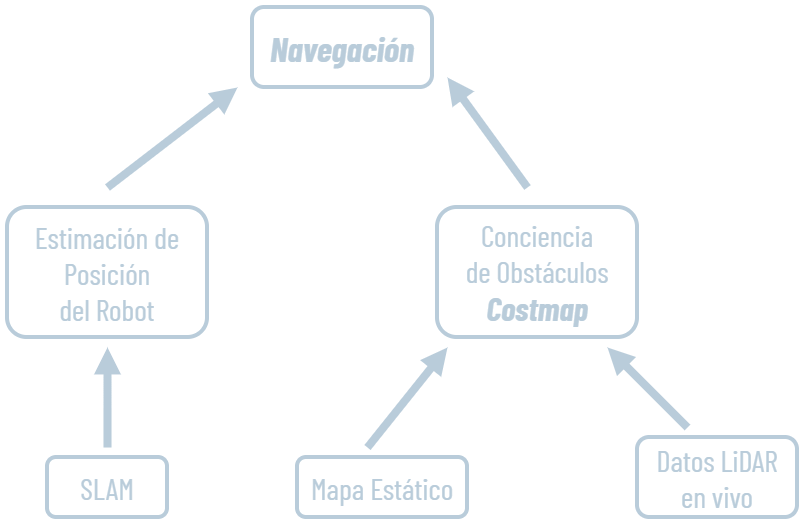
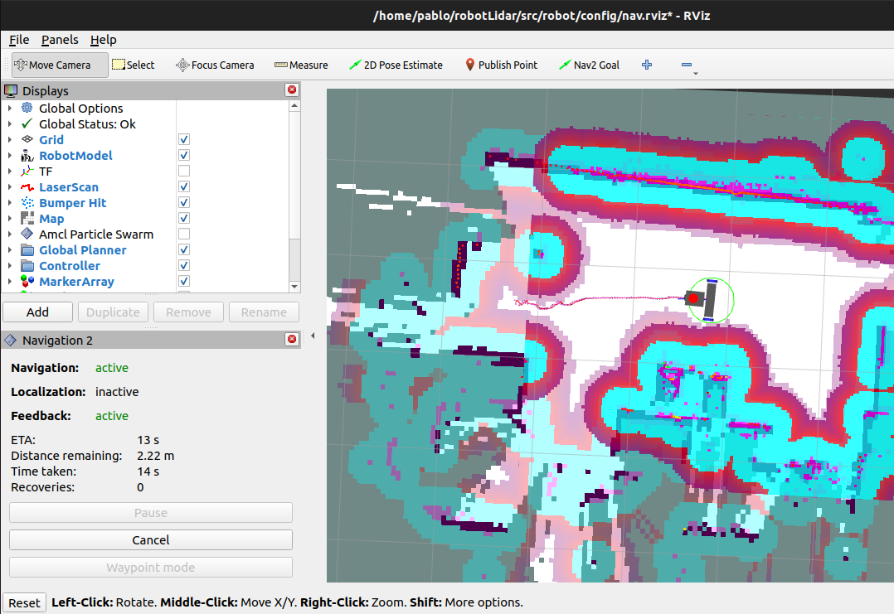

> [!NOTE]
> Navegación autónoma con Nav2 sobre el mapa que construye SLAM Toolbox en vivo (AMCL queda como alternativa con mapa pre-construido). Los objetivos se fijan desde RViz o por CLI; twist_mux multiplexa la teleoperación manual y los comandos de Nav2.

| Parámetro | Valor |
| --- | --- |
| Parámetros | Adaptados desde TurtleBot3 |
| Mapa | Mapa vivo de SLAM (sin AMCL) |
| Lanzamiento | `slam_nav.launch.py` |
| Ajustes por retardo del XV-11 (~300 ms) | `max_vel_theta` 0,4 rad/s, `transform_tolerance` 0,5 s, sin marcha atrás |
| Prioridad de comandos | twist_mux prioriza la teleop (`/cmd_vel_key`) |

## ¿Qué es la navegación?

https://articulatedrobotics.xyz/tutorials/mobile-robot/applications/nav2

https://wiki.hiwonder.com/projects/PuppyPi/en/latest/docs/32.ROS2_Autonomous_Navigation_Course.html#detailed-explanation-of-the-package

https://thinkrobotics.com/blogs/learn/ros2-slam-tutorial-master-simultaneous-localization-and-mapping-for-autonomous-robots

Navegar significa fijar una posición destino en el mapa y lograr que el robot se desplace hacia ese punto siguiendo una trayectoria segura. Para resolver esa tarea se necesitan dos piezas de información: 

**Estimación de posición precisa:** puede provenir de SLAM.

**Reconocimiento de obstáculos**, que puede provenir de dos fuentes complementarias:

- El **mapa generado previamente** por SLAM: los mismos obstáculos que sirvieron para localizarse ahora se usan como zonas a evitar al planificar.
- Los **datos del lidar en vivo**: útiles cuando aparecen obstáculos nuevos, móviles, o no se cuenta con un mapa pregenerado. Pero solo con el lidar no se puede trazar una trayectoria global, porque el robot únicamente “ve” lo que tiene en frente en cada instante.

Por eso se usa la combinación de ambas fuentes. Tanto el mapa estático como las lecturas del lidar se almacenan en un mapa nuevo: el **Costmap** (mapa de costos). 



### Costmap

El Costmap es una grilla de ocupación donde cada celda guarda un costo de tránsito (0–254). Nav2 lo construye fusionando varias capas (arquitectura interna de Nav2).

- Áreas de costo alto (obstáculos, valor 254): se evitan.
- Áreas de costo medio (el espacio cercano a un obstáculo, “zona de inflado”): se transitan con penalidad para no rozar las paredes.
- Áreas de costo bajo (espacio libre): planificación preferente.

En RViz2 se visualiza agregando un display de mapa con el topic `/global_costmap/costmap` y eligiendo el esquema de color `costmap`.

## Arquitectura interna de Nav2

> [!NOTE]
> Nav2 está construido como un conjunto de servidores independientes coordinados por un árbol de comportamiento (Behavior Tree). Cada servidor es un nodo de ROS 2 que expone una action y se especializa en una tarea: planificar, controlar, recuperar.
- BT Navigator Server: nodo central. Recibe el goal (desde RViz2 o `/goal_pose`) y orquesta a los demás servidores siguiendo un árbol de comportamiento. Implementa dos modos: `NavigateToPose` (un destino) y `NavigateThroughPoses` (waypoints).
- Planner Server: calcula la trayectoria global desde la pose actual hasta el goal, usando el global costmap.
- Controller Server: sigue la trayectoria global y genera los comandos de velocidad (`/cmd_vel`) usando el local costmap.
- Recovery / Behaviors Server: gestiona las acciones de recuperación cuando algo falla (girar en el lugar, retroceder, esperar a que el costmap se actualice).

El flujo conceptual es: BT Navigator pide un plan al Planner Server → entrega ese plan al Controller Server → si el Controller no puede avanzar, BT Navigator invoca al Recovery Server → reintenta. Todo esto sobre dos costmaps distintos:

- Global Costmap: parte del Planner Server, abarca todo el entorno conocido. Sus capas típicas son:
    - Static Map Layer: el mapa generado por SLAM.
    - Obstacle Layer: obstáculos detectados por sensores durante la navegación.
    - Inflation Layer: expansión alrededor de cada obstáculo.
- Local Costmap: parte del Controller Server, es una ventana pequeña centrada en el robot que se actualiza a alta frecuencia. Contiene Obstacle Layer + Inflation Layer (no necesita la capa estática porque opera localmente).

## Topics y nodos involucrados en el proyecto

Lo que ocurre cuando lanzamos Nav2 en nuestro robot (resumido):

1. Un servidor `map_server` carga el mapa (archivo `.yaml` + `.pgm`) y lo publica en el topic `/map`. 
2. El nodo AMCL localiza al robot dentro del mapa usando Monte Carlo y el topic `/scan`. (En el flujo real del proyecto la localización la provee SLAM Toolbox en modo mapeo continuo) 
3. Nav2 toma objetivos de navegación (2D Nav Goals desde RViz2 o publicados en `/goal_pose`) y genera velocidades en `/cmd_vel`.
4. twist_mux arbitra entre las velocidades de Nav2 y la teleoperación manual, y las reenvía al controlador.

## Instalación y ejecución básica de Nav2

```bash
# Instalación
sudo apt install ros-humble-navigation2 ros-humble-nav2-bringup

# Ejecución aislada (sin twist_mux, con SLAM o AMCL ya corriendo)
ros2 launch nav2_bringup navigation_launch.py
```

Una vez levantado Nav2, en RViz2 se puede:

1. **Visualizar el costmap**: agregar un display *Map* con el topic `/global_costmap/costmap` y setear el esquema de colores como `costmap`.
2. **Setear un destino**: usar el botón **2D Goal Pose** del toolbar (click-y-arrastrar para definir posición y orientación final).
3. **Panel de Nav2**: análogo al `SlamToolboxPlugin`, se puede agregar el panel **Navigation 2** (Panels → Add New Panel → Navigation 2). Este panel habilita el modo **waypoint**, donde se encadenan múltiples objetivos de posición y el robot los recorre en orden con un solo *Go*.

## Paso previo: Multiplexación de velocidades con twist_mux

El problema: `diff_drive_controller` espera comandos en `/diff_cont/cmd_vel_unstamped`, pero Nav2 publica en `/cmd_vel`. Soluciones previas usaban remapeos directos. La solución definitiva es `twist_mux`, que:

- Multiplexa múltiples fuentes de velocidad en un único topic de salida.
- Permite asignar **prioridades** y **bloqueos** entre fuentes (teleop > Nav2 cuando el operador interviene).

```bash
sudo apt install ros-humble-twist-mux

# Lanzar twist_mux
ros2 run twist_mux twist_mux \
  --ros-args --params-file ./src/robot/config/twist_mux.yaml \
  -r cmd_vel_out:=diff_cont/cmd_vel_unstamped
```

El nodo escucha `/cmd_vel` (Nav2) y `/cmd_vel_key` (teclado) y genera un único `/cmd_vel_out`.

```bash
# Teleop remapeado al topic twist_mux
ros2 run teleop_twist_keyboard teleop_twist_keyboard \
  --ros-args -r /cmd_vel:=/cmd_vel_key
```

### Otras opciones de teleop disponibles

- **`joy_teleop`** (con joystick físico): más cómodo para el robot real.
- **Foxglove Bridge + RViz interactive markers**: teleop desde GUI, ideal en simulaciones.

## Configuración basada en turtlebot3 waffle_pi

[https://github.com/ROBOTIS-GIT/turtlebot3/blob/humble/turtlebot3_navigation2/param/waffle_pi.yaml](https://github.com/ROBOTIS-GIT/turtlebot3/blob/humble/turtlebot3_navigation2/param/waffle_pi.yaml)

Nav2 trae un archivo `nav2_params.yaml` de referencia en el paquete `nav2_bringup`. Los valores por defecto de ese archivo están calibrados para el **TurtleBot3**, un robot diferencial de Robotis ampliamente usado como plataforma de aprendizaje en ROS (producción física y simulaciones). Conocer brevemente sus características ayuda a entender qué parámetros conviene tocar al portar la configuración a nuestro robot.

### ¿Qué es TurtleBot3 Waffle Pi?

- Robot diferencial “oficial” de ROS, con base cuadrada de ~28 × 30 cm y radio efectivo de ≈18 cm.
- Velocidad máxima lineal de ≈0.26 m/s y angular de ≈1.82 rad/s.
- Lidar 2D LDS-01 / LDS-02 (360°, ~3.5 m de alcance) y Raspberry Pi como computadora de a bordo.

La estrategia adoptada fue copiar la plantilla oficial y ajustar los puntos donde nuestro robot difiere del Waffle Pi:

```bash
cp /opt/ros/humble/share/nav2_bringup/params/nav2_params.yaml \
   ~/robotLidar/src/robot/config/
```

Luego se lanza Nav2 apuntando a esta copia local:

```bash
ros2 launch nav2_bringup navigation_launch.py \
  params_file:=~/robotLidar/src/robot/config/nav2_params.yaml
```

### Parámetros que típicamente conviene revisar

No todos los parámetros se tocan; muchos se dejan por defecto y solo se ajustan los que dependen de la geometría y dinámica del robot:

- **`robot_radius`** (en `local_costmap` y `global_costmap`): radio efectivo del robot. Si es muy chico el robot roza paredes; muy grande, no encuentra caminos.
- **`inflation_radius`** y **`cost_scaling_factor`**: cuánto y cómo se penaliza el espacio cercano a obstáculos.
- **`max_vel_x`**, **`max_vel_theta`**, **`acc_lim_x`**, **`acc_lim_theta`** (en controller / DWB): límites de velocidad y aceleración; deben coincidir con lo que el `diff_drive_controller` y los motores realmente pueden entregar.
- **`scan_topic`** y **`observation_sources`** (capa de obstáculos): apuntar al topic correcto del lidar (`/scan`) y declarar el tipo de mensaje (`LaserScan`).
- **`base_frame`** / **`global_frame`**: en el proyecto se usa `base_footprint` como `base_frame` (en lugar de `base_link`), por consistencia con SLAM Toolbox.

> [!NOTE]
> Todos los cambios se encuentran con sus respectivos comentarios en el repositorio del proyecto: [https://github.com/pablem/2025-LidarRobot](https://github.com/pablem/2025-LidarRobot)



## Ajustes derivados de la experimentación

**Síntoma:** el robot chocaba al completar giros en esquinas; su contorno atravesaba celdas de costo máximo ya marcadas.

**Diagnóstico:**

```bash
ros2 run tf2_ros tf2_monitor map odom
# Average Delay: -0.247  Max Delay: 0.033

ros2 topic delay /scan
# average delay: 0.301 s  std dev: 0.001 s
```

**Causa:** el XV-11 tarda ~220 ms por barrido; con la latencia serie/USB el retardo total es ~300 ms. En traslación es inocuo; en rotación (a 0,6 rad/s) equivale a ~10° de error de rumbo.

| Parámetro | Inicial | Vigente | Motivo |
| --- | --- | --- | --- |
| `transform_tolerance` | 0,3 s | 0,5 s | Cubre el retardo map→odom |
| `max_vel_theta` | 0,6 rad/s | 0,4 rad/s | Error de giro ∝ velocidad angular |
| `acc_lim_theta` | 2,2 rad/s² | 1,3 rad/s² | Suaviza la dinámica de giro |
| `angle_variance_penalty` (SLAM) | 1,0 | 0,4 | Más peso a la odometría en rotaciones |
| `distance_variance_penalty` (SLAM) | 0,5 | 0,3 | Ídem en traslación |
| `minimum_travel_heading` (SLAM) | 0,1 rad | 0,2 rad | Compromiso estabilidad / error al girar |
| `minimum_travel_distance` (SLAM) | 0,10 m | 0,15 m | Ídem en desplazamiento lineal |
| `cost_scaling_factor` | 2,5 / 2,0 | 1,2 | Trayectorias centradas en el pasillo |
| `inflation_radius` | 0,30 m | 0,27 local / 0,28 global | Paso por zonas estrechas |
| `min_vel_x` | −0,10 m/s | 0,0 m/s | Sin marcha atrás (sólo en recuperación) |
| `BaseObstacle.scale` | 0,2 | 0,5 | Más peso a evitar obstáculos |
| `observation_persistence` | 1,5 s | 3,0 local / 5,0 global | Retiene obstáculos finos (patas de sillas) |
| `update_frequency` (global) | 1,0 Hz | 2,0 Hz | Obstáculos nuevos al plan global más rápido |

> [!NOTE]
> Compromiso asumido: el entorno se supone estático. Un objeto que se mueve deja un obstáculo fantasma por algunos segundos; a cambio no se pierden obstáculos finos que el sensor detecta de forma intermitente.

## Inicialización de nodos: Nav2 + SLAM Toolbox + twist_mux

> [!TIP]
> **Flujo real usado en el proyecto**: No se usa AMCL: la localización la provee SLAM Toolbox en modo mapeo continuo y, en paralelo, Nav2 consume el `/map` y la TF `map → odom → base_link` que SLAM Toolbox publica.

```bash
# Terminal 1: robot (controladores, URDF, lidar, IMU)
ros2 launch robot launch_robot.launch.py

# Terminal 2 (robot): SLAM + Nav2 (mapeo + navegación simultáneos)
ros2 launch robot slam_nav.launch.py

# Terminal 3 (PC): visualización
rviz2 -d ~/robotLidar/src/robot/config/nav.rviz

# (opcional) Terminal 4: teleop manual va a /cmd_vel_key, twist_mux la prioriza sobre Nav2
ros2 run teleop_twist_keyboard teleop_twist_keyboard --ros-args -r /cmd_vel:=/cmd_vel_key
```

Goal por CLI (útil para ensayos repetitivos; el guardado de mapa está en SLAM):

```bash
ros2 topic pub --once /goal_pose geometry_msgs/msg/PoseStamped \
  "{header: {frame_id: 'map'}, pose: {position: {x: 1.5, y: 0.0}}}"
```

De esta forma, mientras el robot navega, las nuevas zonas exploradas se incorporan al mapa de SLAM y a su vez al costmap global de Nav2. El operador puede interrumpir en cualquier momento con la teleop, gracias a la prioridad configurada en `twist_mux`.

---

## FIFO RT Scheduling

El `controller_manager` intenta configurarse con prioridad de tiempo real (FIFO) para garantizar el control a 100 Hz exactos, pero la Raspberry Pi 4 con Ubuntu 22.04 estándar no lo permite sin configuración especial del kernel. Esto genera un warning en el log pero no afecta la operación normal del robot.

Referencia: [https://control.ros.org/master/doc/ros2_control/controller_manager/doc/userdoc.html](https://control.ros.org/master/doc/ros2_control/controller_manager/doc/userdoc.html)

---

## Alternativa: NAV2 con AMCL (localización con mapa pre-existente)

En vez de lanzar SLAM Toolbox, lanzar AMCL (requiere de un mapa ya generado):

```bash
ros2 launch nav2_bringup localization_launch.py \
  map:=./mi_mapa.yaml use_sim_time:=true

# Luego lanzamos Nav2 suscrito al mapa:
ros2 launch nav2_bringup navigation_launch.py \
  use_sim_time:=true map_subscribe_transient_local:=true
```

---

## Cartographer como alternativa a SLAM Toolbox

Cartographer es otra herramienta de SLAM 2D/3D de Google. Se documenta como alternativa explorada pero no usada.

```bash
sudo apt install ros-humble-cartographer
sudo apt install ros-humble-cartographer-ros
```

## Referencias

- [docs.nav2.org](https://docs.nav2.org)
- [github.com/ros-navigation/navigation2](https://github.com/ros-navigation/navigation2)
- [github.com/ros-teleop/twist_mux](https://github.com/ros-teleop/twist_mux)
- [articulatedrobotics.xyz/tutorials/mobile-robot/applications/nav2](https://articulatedrobotics.xyz/tutorials/mobile-robot/applications/nav2)
- [wiki.hiwonder.com/projects/PuppyPi/en/latest/docs/32.ROS2_Autonomous_Navigation_Course.htm](https://wiki.hiwonder.com/projects/PuppyPi/en/latest/docs/32.ROS2_Autonomous_Navigation_Course.html#detailed-explanation-of-the-package)
- [thinkrobotics.com/blogs/learn/ros2-slam-tutorial-master-simultaneous-localization-and-mapp](https://thinkrobotics.com/blogs/learn/ros2-slam-tutorial-master-simultaneous-localization-and-mapping-for-autonomous-robots)
- [github.com/pablem/2025-LidarRobot](https://github.com/pablem/2025-LidarRobot)
- [control.ros.org/master/doc/ros2_control/controller_manager/doc/userdoc.html](https://control.ros.org/master/doc/ros2_control/controller_manager/doc/userdoc.html)
