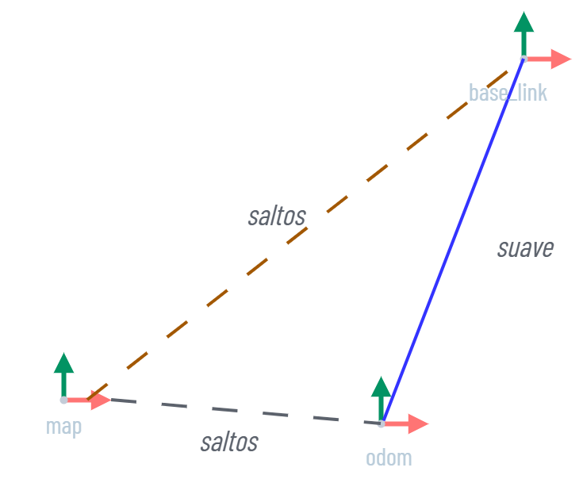
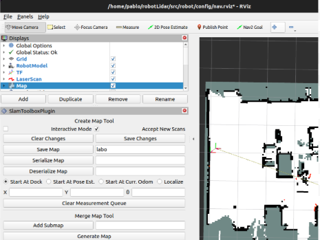
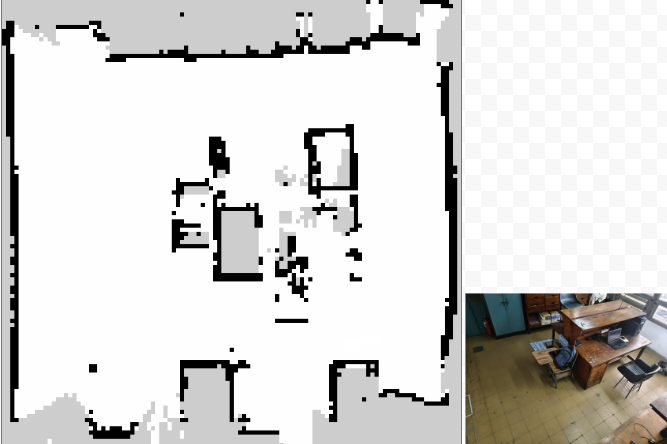

| Parámetro | Valor |
| --- | --- |
| Nodo | slam_toolbox online asíncrono, modo mapeo |
| Resolución | 0,05 m |
| Alcance máx. | 3 m |
| Loop closure | Desactivado |
| TF | `map → odom` |
| Guardado | Serialización automática al volver a la base |
| Modo localización | Descartado |

## ¿Qué es SLAM?

https://articulatedrobotics.xyz/tutorials/mobile-robot/applications/slam

https://docs.ros.org/en/humble/p/slam_toolbox/

https://joss.theoj.org/papers/10.21105/joss.02783 (paper)

SLAM (Simultaneous Localization And Mapping) es el método que le permite a un robot construir un mapa del entorno y localizarse en él al mismo tiempo usando los escaneos del LiDAR y la odometría.

Existen dos categorías principales:

- **Landmark-based SLAM**: usa puntos de referencia reconocibles del entorno.
- **Grid SLAM** (nuestro proyecto): representa el entorno como una cuadrícula de ocupación.

### Diferencias entre Mapping / Localización / Navegación

Un mapa se puede construir mediante un sensor que describa la posición exacta en todo momento, a medida que nos desplazamos, almacenamos la posición de cada objeto dentro de un sistema de coordenadas global.  

Una vez construido el mapa, puede usarse para localizarse si se ve un patrón de objetos conocidos (aún sin el sensor que usamos para mapear), el mapa permite determinar la posición con bastante precisión dentro del sistema de coordenadas.

La navegación va un paso más allá de la localización: usa el mapa para calcular un camino hasta un objetivo y planificar una trayectoria segura a través del entorno. La navegación avanzada puede actualizar esa trayectoria dinámicamente a medida que se detectan nuevos obstáculos o cambios en el entorno. En ROS 2 esto se implementa con el stack Nav2.

### Grid SLAM

En Grid SLAM el entorno se divide en una cuadrícula 2D de celdas. Cada celda almacena una probabilidad de ocupación: la probabilidad de que ese espacio esté bloqueado por un obstáculo. El sensor LiDAR actualiza estas probabilidades con cada nuevo escaneo, las celdas atravesadas por el haz (espacio libre) disminuyen su probabilidad, mientras que la celda donde el haz impacta (obstáculo) la aumenta.

Esta representación permite mapear entornos arbitrarios sin necesidad de identificar puntos de referencia específicos. La resolución de la cuadrícula es un parámetro clave: celdas más pequeñas producen mapas más detallados a costa de mayor costo computacional y de memoria. Un desafío central de Grid SLAM es el **loop closure**: cuando el robot regresa a un lugar ya visitado, el algoritmo debe reconocerlo y corregir el error acumulado en la trayectoria estimada. Sin este mecanismo, la odometría se desvía progresivamente y las paredes del mapa no cierran correctamente. **slam_toolbox** implementa Grid SLAM con soporte de loop closure y optimización de grafo de poses en segundo plano (ajuste de posiciones y orientación). 

## SLAM en ROS

### Dos conceptos clave: repaso de Frames y [TF2](../fundamentos/diccionario.md)

https://www.ros.org/reps/rep-0105.html

[¿qué es REP?](../fundamentos/diccionario.md)

En ROS, un frame (o “marco”) es un sistema de coordenadas anclado a alguna parte del robot. [TF2](../fundamentos/diccionario.md) es la biblioteca que mantiene las relaciones espaciales entre todos los frames y permite transformar una medición de un frame a cualquier otro.

Se usan tres frames de coordenadas fundamentales para SLAM:

- **`odom`**: frame de odometría local. Describe el desplazamiento del robot integrando sensores de movimiento (encoders). Es continuo y suave (ideal para control) pero acumula error con el tiempo.
- **`map`**: frame global generado por SLAM. Representa el entorno mapeado y se considera fijo en el mundo. Introduce correcciones globales que alinean la trayectoria estimada con el entorno real. No es continuo, se actualiza de a saltos.
- **`base_link`** / **`base_footprint`**: frame del cuerpo del robot. Todas las velocidades y comandos de movimiento están referidos a este frame.



El árbol de frames del robot es: 

```
map → odom → base_footprint → base_link → chassis → laser_frame
                                                  → imu_frame
```

- `map → odom`: publicado por SLAM Toolbox (corrige el error acumulado de la odometría).
- `odom → base_link`: publicado por el nodo EKF de `robot_localization` (se actualiza continuamente con los encoders e IMU).
- `base_link` / `chassis` / `laser_frame` / `imu_frame`: publicados estáticamente por `robot_state_publisher` desde el [URDF](../fundamentos/diccionario.md) (no cambian).

Un frame solo puede tener un padre, por lo que SLAM no publica `map → base_link` directamente: calcula la corrección `map → odom` para preservar la continuidad de la odometría local, mientras que el frame `map` introduce correcciones globales cada vez que el algoritmo ajusta la trayectoria.

#### El topic /odom vs. la TF odom→base_link

El topic `/diff_cont/odom` (odometría calculada con los encoders) contiene la misma información de localización que la TF `odom → base_link`, pero además incluye la **velocidad actual** y las **covarianzas** asociadas. El EKF consume ambas fuentes y publica `/odometry/filtered` como la estimación combinada.

#### base_link vs. base_footprint

En robots que operan en 3D (drones), `base_link` puede elevarse en el eje Z mientras que `base_footprint` representa la “sombra” proyectada en el plano XY. En este robot diferencial plano, `base_footprint` está fijo a `base_link`; son prácticamente equivalentes, pero se mantiene `base_footprint` por compatibilidad con SLAM Toolbox y Nav2.

## Modo de operación: Online Asíncrono

- **Online**: el nodo procesa datos en vivo (data stream), y no a posteriori.
- **Asynchronous**: el LiDAR y la odometría se procesan en hilos separados sin esperar a un ciclo fijo de optimización. El robot puede continuar recibiendo comandos mientras se actualiza el mapa; la optimización global (loop closure, ajuste de pose) ocurre en segundo plano a diferencia del modo síncrono, que bloquea el nodo para recalcular.

## Instalación

```bash
sudo apt install ros-humble-slam-toolbox

# Verificar ejecutables disponibles
ros2 pkg executables slam_toolbox
# slam_toolbox async_slam_toolbox_node
# slam_toolbox localization_slam_toolbox_node
# slam_toolbox map_and_localization_slam_toolbox_node
# slam_toolbox merge_maps_kinematic
# slam_toolbox sync_slam_toolbox_node
```

## Configuración

[https://github.com/SteveMacenski/slam_toolbox/blob/ros2/config/mapper_params_localization.yaml](https://github.com/SteveMacenski/slam_toolbox/blob/ros2/config/mapper_params_localization.yaml)

Copiar la plantilla de configuración al workspace:

```bash
cp /opt/ros/humble/share/slam_toolbox/config/mapper_params_online_async.yaml \
   ~/robotLidar/src/robot/config/
```

Parámetros relevantes del archivo `mapper_params_online_async.yaml`:

```yaml
# Archivo: /robot/config/mapper_params_online_async.yaml
slam_toolbox:
  ros__parameters:
    mode: mapping
    odom_frame: odom
    map_frame: map
    base_frame: base_footprint
    scan_topic: /scan
    resolution: 0.05
    min_laser_range: 0.1
    max_laser_range: 3.0          # el XV-11 pierde precisión más allá de 3 m
    throttle_scans: 2
    map_update_interval: 3.0
    transform_publish_period: 0.02
    transform_timeout: 0.7
    tf_buffer_duration: 60.0
    # Frecuencia de incorporación de barridos
    minimum_travel_distance: 0.15
    minimum_travel_heading: 0.2
    # Penalidades del emparejamiento de barridos
    distance_variance_penalty: 0.3
    angle_variance_penalty: 0.4
    do_loop_closing: false        # origen de saltos grandes en el mapa
```

> [!NOTE]
> Penalidades y umbrales de desplazamiento ajustados por el retardo del láser (~300 ms): ver tabla de ajustes en [Navegación con Nav2](./nav2.md).

## Ejecución

### Inicializar SLAM Toolbox

En el robot se levanta junto con Nav2: `ros2 launch robot slam_nav.launch.py`. Para correrlo aislado:

```bash
ros2 launch slam_toolbox online_async_launch.py \
  slam_params_file:=/home/pablo/robotLidar/src/robot/config/mapper_params_online_async.yaml
```

O bien incluyendo el nodo en el launcher del robot:

```python
slam_toolbox = Node(
    package='slam_toolbox',
    executable='async_slam_toolbox_node',
    name='slam_toolbox',
    output='screen',
    parameters=[
        os.path.expanduser(
            '~/robotLidar/src/robot/config/mapper_params_online_async.yaml'
        )
    ]
)
```

### Comandos CLI útiles

```bash
# Ver pose actual
ros2 run tf2_ros tf2_echo map base_link

# Listar servicios disponibles de SLAM Toolbox
ros2 service list
```

### Guardado del mapa

Desde RViz2, agregar el panel: **Panels → Add New Panel → SlamToolboxPlugin**.





Existen dos formatos de guardado:

- **Save Map (`.pgm` + `.yaml`)**: formato PGM estándar, compatible con aplicaciones externas (AMCL, nav2_map_server).
- **Serialize Map (`.data` + `.posegraph`)**: formato nativo de SLAM Toolbox para reutilizar el mapa (relocalizar, navegar o seguir construyendo).

```bash
# Serializar por servicio (alternativa a la GUI)
ros2 service call /slam_toolbox/serialize_map slam_toolbox/srv/SerializePoseGraph \
  "{filename: '/home/robot_lidar/mapa_labo'}"
```

Este comando está incluido en el script de retorno a base: el mapa se guarda cada vez que el robot vuelve a la base o se queda en el camino.

## Consideraciones importantes del proyecto

- **Modo localización descartado (por ahora)**: el modo localización de SLAM Toolbox producía desfase en la pose inicial y “saltos” en el mapa (hipótesis 1: conflicto de pose inicial; hipótesis 2: conflicto en el árbol de TF). Se usa modo mapeo, que genera el mapa de cero relativamente rápido y se delega la localización únicamente a `robot_localization` (aunque, no está claro hasta ahora si la localización de slam y mapeo coexisten en este modo)
- **DDS**: se cambió a **Cyclone DDS** para tratar de resolver errores de desincronización entre los datos del XV-11 y SLAM Toolbox (ver página Ubuntu/ROS Setup).
- **Umbrales de rechazo en el EKF** (`odom0_pose/twist_rejection_threshold`): descartan mediciones anómalas que causaban saltos en el mapa.
- **Distancia máxima de mapeo**: `max_laser_range: 3.0` m (el fabricante declara 5 m, pero la precisión se degrada).
- **Loop closure desactivado** (`do_loop_closing: false`): generaba saltos grandes en el mapa.
- **Limitación del sensor**: no percibe obstáculos por debajo de la altura del LiDAR (p. ej. largueros inferiores de mesones).

---

## (CONCEPTUAL, NO PRÁCTICO) Localización con AMCL (Adaptive Monte Carlo Localisation)

AMCL localiza al robot en un mapa ya construido, ajustando bien la pose ante grandes desviaciones entre la odometría y la posición real.

> [!NOTE]
> **⚠** Es una alternativa al **procedimiento práctico**: en lugar de AMCL con mapa estático, también es posible correr SLAM Toolbox + Nav2 simultáneamente (se mapea y navega a la vez)

> [!WARNING]
> La implementación standard de AMCL en ROS2 es parte del stack Nav2 que veremos en el módulo de navegación. Los pasos a continuación indican un procedimiento manual y más engorroso para aprender sobre los procesos que corren por detrás de la localización:

### Pasos para usar AMCL con mapa pre-construido

**1. Instalar Nav2:** 

```bash
sudo apt install ros-humble-navigation2 ros-humble-nav2-bringup

# Turtlebot 3 (para futuros tutoriales): (PENDIENTE: docu de turtlebot3)
sudo apt install ros-humble-turtlebot3*
```

**2. Lanzar el servidor de mapa:**

```bash
ros2 run nav2_map_server map_server \
  --ros-args -p yaml_filename:=mapa_labo.yaml
# Queda esperando transición de ciclo de vida externo
```

**3. Activar el ciclo de vida del map_server:**

```bash
ros2 run nav2_util lifecycle_bringup map_server
# El mapa aparece en RViz2 (establecer durabilidad: Transient_local)
```

**4. Lanzar AMCL:**

```bash
ros2 run nav2_amcl amcl
ros2 run nav2_util lifecycle_bringup amcl
# AMCL informa: "Please set the initial pose..."
```

**5. Indicar la pose inicial** en RViz2 con el botón **2D Pose Estimate** (equivale a publicar en `/initialpose`)

**6. Ajustar configuración de Nav2 AMCL** para mejor corrección de odometría.

---

## SLAM en simulación (Gazebo Fortress)

```bash
ros2 launch robot launch_sim.launch.py
ros2 launch robot slam_nav.launch.py use_sim_time:=true
```

Detalle en [Simulaciones en Gazebo Fortress](../simulacion/gazebo-fortress.md).

## Referencias

- [docs.ros.org/en/humble/p/slam_toolbox](https://docs.ros.org/en/humble/p/slam_toolbox/)
- [github.com/SteveMacenski/slam_toolbox](https://github.com/SteveMacenski/slam_toolbox)
- [ros.org](http://ros.org)
- [ros.org/reps/rep-0105.html](https://www.ros.org/reps/rep-0105.html)
- [es.mathworks.com/discovery/slam.html](https://es.mathworks.com/discovery/slam.html)
- [articulatedrobotics.xyz/tutorials/mobile-robot/applications/slam](https://articulatedrobotics.xyz/tutorials/mobile-robot/applications/slam)
- [joss.theoj.org/papers/10.21105/joss.02783](https://joss.theoj.org/papers/10.21105/joss.02783)
