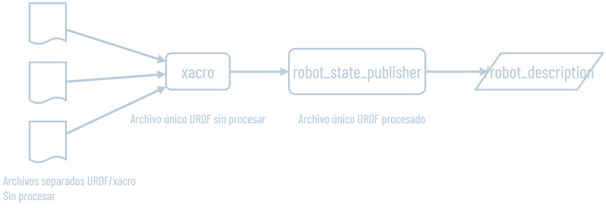
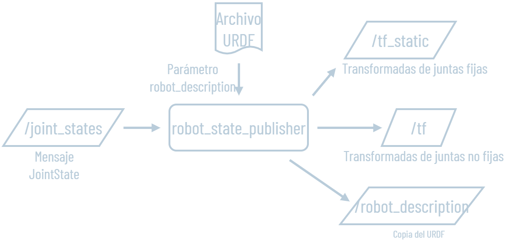

> [!NOTE]
> `ros2_control` es el framework que conecta los comandos de velocidad de Nav2/teleop con el firmware del ESP32-S3. La capa de hardware (`diffdrive_arduino`) convierte velocidades de rueda en cuentas de encoder y viceversa. El diff_drive_controller calcula la odometría y la publica en `/diff_cont/odom`.

| Parámetro | Valor |
| --- | --- |
| Interfaz | diffdrive_arduino modificado (parámetros por rueda + lectura de batería) |
| Comunicación | 57600 baudios, lazo a 100 Hz |
| Cuentas por vuelta | 33667 / 41800 |
| wheel_separation | 0,408 m |
| wheel_radius | 0,056 m |
| TF | `odom → base_link` (publicado por el EKF) |

## Recursos

https://control.ros.org/master/doc/getting_started/getting_started.html

https://control.ros.org/master/doc/ros2_controllers/diff_drive_controller/doc/userdoc.html

https://articulatedrobotics.xyz/tutorials/mobile-robot/applications/ros2_control-concepts/

https://github.com/ros-controls/ros2_control_demos/tree/humble/example_2

https://github.com/ros-controls/ros2_control_demos/blob/humble/example_2/doc/userdoc.rst

https://github.com/joshnewans/serial

https://github.com/joshnewans/diffdrive_arduino/tree/humble

## ¿Qué es ros2_control?

En cualquier robot existe el mismo problema central: recibir una orden (de un operador o del entorno), procesarla y mover un actuador. Sin un framework estándar, cada proyecto reescribe desde cero el driver del hardware y el algoritmo de control. `ros2_control` es la solución: un framework que define un lenguaje común para que los drivers de hardware y los algoritmos de control sean intercambiables y reutilizables.

> [!TIP]
> En términos prácticos para este robot: `ros2_control` es la capa que convierte un mensaje `/cmd_vel` ("avanzar a 0.3 m/s") en pulsos PWM reales hacia los motores, y que toma la lectura de los encoders para calcular cuántos metros se movió.

### Controller Manager

Es el núcleo del framework. Su trabajo es encontrar y conectar dos tipos de plugins:

- **Hardware Interfaces** (drivers del hardware físico)
- **Controllers** (algoritmos de control)

Al arrancar, el Controller Manager carga ambos tipos de plugins y los enlaza a través del Resource Manager, que expone todas las interfaces de hardware disponibles en una lista unificada.

### Hardware Interfaces

Un hardware interface es el driver que habla con el hardware real y lo expone de forma estándar. Abstrae completamente el medio de comunicación (serial, CAN, I²C, etc.) y presenta el hardware únicamente a través de dos tipos de interfaces:

- **Command Interfaces**: lo que se puede *controlar* (escribir). Por ejemplo: la velocidad objetivo de cada motor.
- **State Interfaces**: lo que se puede *leer* (solo monitorear). Por ejemplo: la velocidad medida y la posición acumulada de cada rueda según los encoders.

En este robot el hardware interface es `diffdrive_arduino`. Expone 2 command interfaces (velocidad de rueda izquierda y derecha) y 4 state interfaces (posición y velocidad de cada rueda), comunicándose con el ESP32-S3 por serial a 57600 baudios.

```
Command interfaces (escritura):
  left_wheel_joint/velocity
  right_wheel_joint/velocity

State interfaces (lectura):
  left_wheel_joint/position
  left_wheel_joint/velocity
  right_wheel_joint/position
  right_wheel_joint/velocity
```

> [!NOTE]
> Las interfaces se declaran en el URDF dentro de la etiqueta `<ros2_control>`.

### Controllers

Los controllers son la cara de `ros2_control` hacia el resto del ecosistema ROS. Por un lado escuchan un topic (por ejemplo `/cmd_vel`) y por otro lado escriben en las command interfaces del hardware. También pueden leer state interfaces y publicar datos de estado (odometría, joint states, etc.).

El paquete `ros2_controllers` incluye controllers listos para usar. Para este robot se usan los componentes:

**`diff_drive_controller.` El controlador para robots móviles con tracción diferencial,** recibe velocidades en formato Twist (`linear.x` + `angular.z`) desde `/diff_cont/cmd_vel_unstamped`, las convierte en velocidades individuales de rueda izquierda y derecha (PWM), y calcula la odometría a partir de los encoders (”ticks por frame”) publicándola en `/diff_cont/odom`.

**`joint_state_broadcaster.`** Elemento secundario, lee state interfaces y publica en `/joint_states` para que `robot_state_publisher` genere las transformaciones TF de las ruedas.

**`controller_manager.`** Es el núcleo que une ambos controllers con las interfaces de hardware. **Hardware Interface (`diffdrive_arduino`)** se comunica con el firmware del ESP32-S3 por serial, usando el comando `e` para leer encoders y `m` para enviar velocidades objetivo.

---

## Arquitectura del sistema

```
/cmd_vel (Nav2 / teleop)
    │
    ▼ twist_mux
    │
    ▼ /diff_cont/cmd_vel_unstamped
    │
    ▼ diff_drive_controller (ros2_control)
    │       │
    │       ├─→ /diff_cont/odom        (publicado al EKF)
    │       └─→ /joint_states          (al robot_state_publisher)
    │
    ▼ Hardware Interface (diffdrive_arduino)
    │       Convierte velocidades ←→ cuentas de encoder
    │       Comunica por serial 57600 baudios con el ESP32-S3
    ▼
[ESP32-S3 firmware]  (PI por motor, PCNT encoders, MCPWM motores)
```


## Instalación

```bash
sudo apt install ros-humble-ros2-control \
                 ros-humble-ros2-controllers
# (simulación: ver dependencias en Simulaciones en Gazebo Fortress)

# Hardware interface y dependencia serial
cd ~/robotLidar/src
git clone https://github.com/joshnewans/serial
git clone https://github.com/joshnewans/diffdrive_arduino
cd diffdrive_arduino
git fetch --all
git checkout humble
cd ../..

sudo apt install libserial-dev

colcon build --symlink-install
```

## Configuración URDF/Xacro (`ros2_control.xacro`)

El archivo `ros2_control.xacro` declara las interfaces de hardware. Para un robot diferencial con dos ruedas:

```xml
<ros2_control name="RealRobot" type="system">
  <hardware>
    <plugin>diffdrive_arduino/DiffDriveArduinoHardware</plugin>
    <param name="left_wheel_name">left_wheel_joint</param>
    <param name="right_wheel_name">right_wheel_joint</param>
    <param name="loop_rate">100</param>
    <param name="device">/dev/serial/by-id/usb-Espressif_USB_JTAG_serial_debug_unit_10:20:BA:4D:92:80-if00</param>
    <param name="baud_rate">57600</param>
    <param name="timeout_ms">100</param>
    <param name="enc_counts_per_rev_left">33667</param>
    <param name="enc_counts_per_rev_right">41800</param>
    <param name="battery_voltage_min">12.0</param>
    <param name="battery_voltage_max">16.8</param>
    <param name="battery_runtime_full_min">120.0</param>
    <param name="battery_publish_period">60.0</param>
  </hardware>
  <joint name="left_wheel_joint">
    <command_interface name="velocity">
      <param name="min">-10</param>
      <param name="max">10</param>
    </command_interface>
    <state_interface name="position"/>
    <state_interface name="velocity"/>
  </joint>
  <!-- ídem right_wheel_joint -->
</ros2_control>
```

> [!WARNING]
> Los parámetros `enc_counts_per_rev_left` y `enc_counts_per_rev_right` son **distintos** entre sí porque los encoders físicos no son idénticos. Ver sección Odometría.

Cambios respecto al `diffdrive_arduino` original:

- Parámetros independientes por rueda (cada objeto rueda carga su propia configuración).
- Lectura de la tensión del pack de baterías por el mismo protocolo serie (comando `b`).

## Configuración del controlador (`my_controllers.yaml`)

```yaml
controller_manager:
  ros__parameters:
    update_rate: 100      # acompaña al lazo PI del firmware (100 Hz)

diff_cont:
  ros__parameters:
    type: diff_drive_controller/DiffDriveController
    left_wheel_names: ["left_wheel_joint"]
    right_wheel_names: ["right_wheel_joint"]
    base_frame_id: base_link
    wheel_separation: 0.408          # metros (corregido, ver Odometría)
    wheel_radius: 0.056
    publish_rate: 50.0
    enable_odom_tf: false            # El EKF es el publisher de odom->base_link

joint_broad:
  ros__parameters:
    type: joint_state_broadcaster/JointStateBroadcaster
```

## Lanzar el robot físico

```bash
source install/setup.bash
ros2 launch robot launch_robot.launch.py
```

El launcher inicia: `ros2_control_node`, `controller_manager`, y los spawners de controladores (`diff_cont` y `joint_broad`).

## Comandos CLI útiles

```bash
# Verificar interfaces disponibles
ros2 control list_hardware_interfaces
# command interfaces:
#   left_wheel_joint/velocity [available] [unclaimed]
#   right_wheel_joint/velocity [available] [unclaimed]
# state interfaces:
#   left_wheel_joint/position
#   left_wheel_joint/velocity
#   ...

# Verificar controladores activos
ros2 control list_controllers

# Lanzar controladores manualmente (para pruebas)
ros2 run controller_manager spawner diff_cont
ros2 run controller_manager spawner joint_broad

# Teleop remapeado al topic correcto
ros2 run teleop_twist_keyboard teleop_twist_keyboard \
  --ros-args -r /cmd_vel:=/diff_cont/cmd_vel_unstamped

# Ver odometría en tiempo real
ros2 topic echo /diff_cont/odom
```

## Odometría: correcciones aplicadas

### Cuentas por revolución (enc_counts_per_rev)

Procedimiento (robot ensamblado, por teleoperación): comandar una velocidad de referencia, contar visualmente un número entero de vueltas de rueda y leer las cuentas acumuladas. Repetir en ambas ruedas.

Mediciones con carga:

Motor2(der.): 7 vueltas = 292782 ; 293869; 292214
Motor1(izq): 7 vueltas = 236213; 235364 ; 236289; 235017; 235478
Promedio: I=33667; D=41850

Se ajustaron los valores finales hasta que por fin la trayectoria del robot describió una recta perfecta (motores a la misma velocidad).

Las correcciones se aplicaron en la descripción del hardware:  `robot/description/ros2_control.xacro`

```xml
<ros2_control name="RealRobot" type="system">
        <hardware>
		        <!-- (...) -->
            <param name="enc_counts_per_rev_left">33667</param>
            <param name="enc_counts_per_rev_right">41800</param>
						<!-- (...) -->
```

### Separación de ruedas (wheel_separation)

Tras un giro de 360° sobre el eje, la odometría informaba haber vuelto a la pose inicial mientras el robot había girado físicamente algo más.

```bash
# Comandar el giro
ros2 topic pub /diff_cont/cmd_vel_unstamped geometry_msgs/msg/Twist "{angular: {z: 0.3}}"

# Leer la pose resultante
ros2 topic echo /diff_cont/odom --field pose.pose
```

Ejemplo de salida: 

```yaml
pose:
  position:
    x: -0.0008385496290289157
    y: -0.0009997031262609759
    z: 0.0
  orientation:
    x: 0.0
    y: -0.0
    z: -0.0036786272986984096
    w: -0.9999932338277081
```

El modelo usa

$$
\Delta\theta = \frac{\Delta s_{der} - \Delta s_{izq}}{L}
$$

Un giro mayor al real indica que L es demasiado pequeño. Corrección aplicada:

$$
L_{nuevo} = 0.400 \cdot \frac{366}{360} \approx 0.408 \text{ m}
$$

Con esta corrección el robot queda correctamente posicionado tras un giro de 360°. Se implementó en la configuración del controlador:  `robot/config/my_controllers.yaml`

```yaml
diff_cont:
  ros__parameters:
		#
		# ...
    wheel_separation: 0.408
    wheel_radius: 0.056
    #...
```

<details>
<summary>Opcional: Driver de prueba: serial_motor_demo</summary>

Durante el armado de u-controlador/motores/drivers/encoders, se usó una interfaz gráfica que establece valores de velocidad en los motores. Al iniciar, se cargan parámetros de controlador, como: cuentas por revolución de los encoders o frecuencia del PID

[https://github.com/joshnewans/serial_motor_demo](https://github.com/joshnewans/serial_motor_demo)

```bash
sudo apt-get install python3-serial

# Ejecutar el driver en la RP4:
ros2 run serial_motor_demo driver \
  --ros-args \
  -p encoder_cpr:=41732 \
  -p loop_rate:=100 \
  -p serial_port:=/dev/ttyACM0 \
  -p baud_rate:=57600

# Interfaz gráfica en PC:
ros2 run serial_motor_demo gui
```

```bash
# Ver el ID estable del dispositivo USB
ls -l /dev/serial/by-id/
# usb-Espressif_USB_JTAG_serial_debug_unit_10:20:BA:4D:92:80-if00 -> ../../ttyACM0

# Listar puertos serie disponibles
ls /dev/ttyUSB* /dev/ttyACM* 2>/dev/null
```

</details>

## Simulación en Gazebo Fortress

Mismo `my_controllers.yaml` que el robot real; sólo cambia el plugin de hardware con el arg `sim_mode` (detalle en [Simulaciones en Gazebo Fortress](../simulacion/gazebo-fortress.md)).

```bash
# Lanzar simulación (Gazebo + robot + controllers + bridge + EKF)
ros2 launch robot launch_sim.launch.py

# Teleop
ros2 run teleop_twist_keyboard teleop_twist_keyboard \
  --ros-args -r /cmd_vel:=/cmd_vel_key

# Comparar odometría cruda vs filtrada
ros2 run rqt_plot rqt_plot
# topics: /diff_cont/odom/pose/pose/position/x
#         /odometry/filtered/pose/pose/position/x
```

---

## Conceptos: URDF, Xacro, robot_state_publisher, twist, odometría

### ¿Qué son URDF y Xacro?

Documentación oficial: [https://docs.ros.org/en/humble/Tutorials/Intermediate/URDF/Building-a-Visual-Robot-Model-with-URDF-from-Scratch.html](https://docs.ros.org/en/humble/Tutorials/Intermediate/URDF/Building-a-Visual-Robot-Model-with-URDF-from-Scratch.html)

Los archivos **URDF** (Unified Robot Description Format) describen la estructura física del robot: qué links (piezas) tiene, qué joints (uniones) los conectan, y cuál es la relación espacial entre ellos. 

**Xacro** (XML-MACRO) es la herramienta que provee ROS para hacer el URDF modular y evitar código duplicado. Xacro procesa los archivos URDF por separado y los unifica en uno solo para luego alimentar al nodo `robot_state_publisher`.



### Nodo robot_state_publisher

Toma el URDF y transmite automáticamente todas las transformaciones (TF):

- Las articulaciones **fijas** se publican como transformadas estáticas en `/tf_static`.
- Las articulaciones **móviles** (ruedas) se publican en `/tf` y requieren valores externos; para ello se suscribe a `/joint_states`.
- También publica el URDF completo en el topic `/robot_description` para que cualquier nodo que lo necesite lo pueda consumir.

El topic `/joint_states` contiene la posición, velocidad o esfuerzo de cada articulación. En el robot real estos valores provienen del `joint_state_broadcaster` de `ros2_control`. En simulación, provienen de Gazebo o del `joint_state_publisher_gui`.



### ¿Qué es twist?

**`geometry_msgs/Twist`** es el mensaje estándar de ROS2 para expresar velocidades. Contiene dos vectores de tres componentes cada uno: `linear` (vx, vy, vz) y `angular` (ωx, ωy, ωz).

Para un robot de tracción diferencial moviéndose en un plano, solo dos de esos seis componentes son físicamente realizables: `linear.x` (avance/retroceso en m/s) y `angular.z` (giro sobre el eje vertical en rad/s). Los cuatro restantes se fijan a cero.

### ¿Cómo se calcula la odometría?

Para estimar la posición, el sistema integra la velocidad real obteniendo pequeños pasos que se acumulan. Este proceso se denomina Dead Reckoning (x = v·t) y su resultado es la odometría.

## Referencias

- [github.com/joshnewans/diffdrive_arduino](https://github.com/joshnewans/diffdrive_arduino)
- [control.ros.org/humble/doc/getting_started/getting_started.html](https://control.ros.org/humble/doc/getting_started/getting_started.html)
- [github.com/ros-controls/ros2_control_demos/tree/humble/example_2](https://github.com/ros-controls/ros2_control_demos/tree/humble/example_2)
- [github.com/joshnewans/serial_motor_demo](https://github.com/joshnewans/serial_motor_demo)
- [control.ros.org/master/doc/ros2_controllers/diff_drive_controller/doc/userdoc.html](https://control.ros.org/master/doc/ros2_controllers/diff_drive_controller/doc/userdoc.html)
- [articulatedrobotics.xyz/tutorials/mobile-robot/applications/ros2_control-concepts](https://articulatedrobotics.xyz/tutorials/mobile-robot/applications/ros2_control-concepts/)
- [github.com/joshnewans/serial](https://github.com/joshnewans/serial)
- [docs.ros.org/en/humble/Tutorials/Intermediate/URDF/Building-a-Visual-Robot-Model-with-URDF](https://docs.ros.org/en/humble/Tutorials/Intermediate/URDF/Building-a-Visual-Robot-Model-with-URDF-from-Scratch.html)
