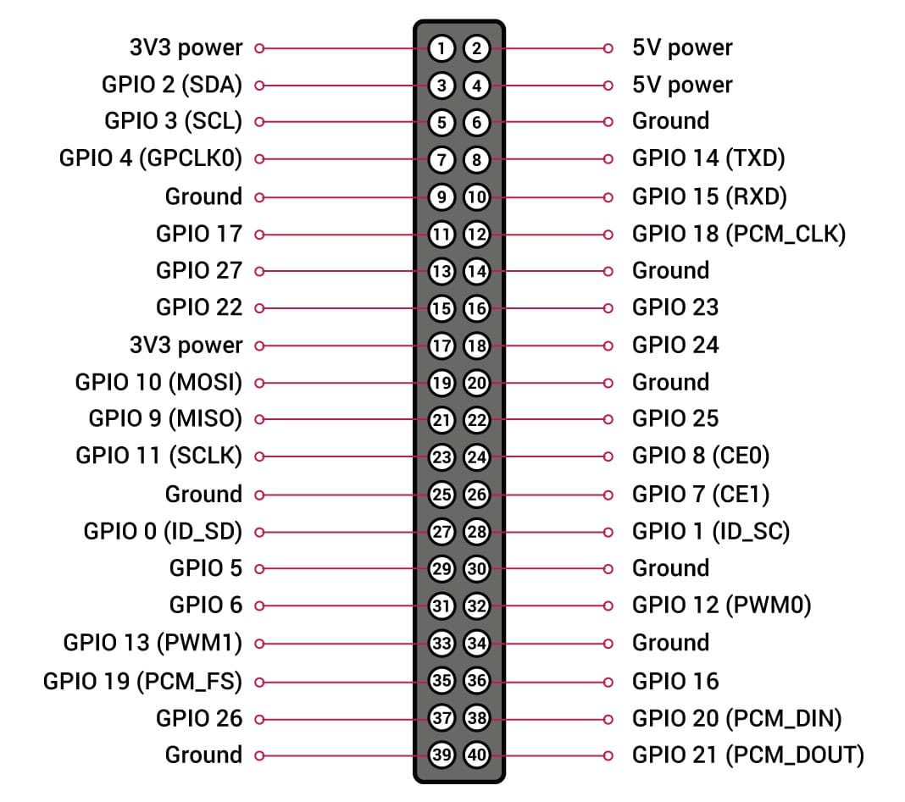
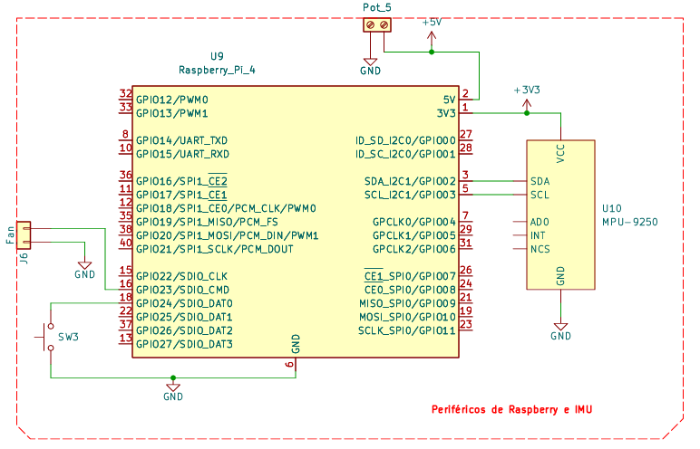
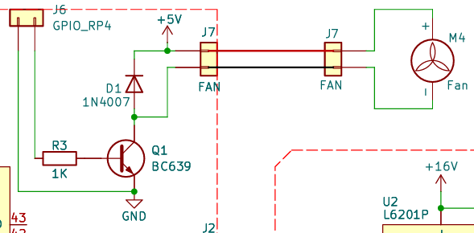
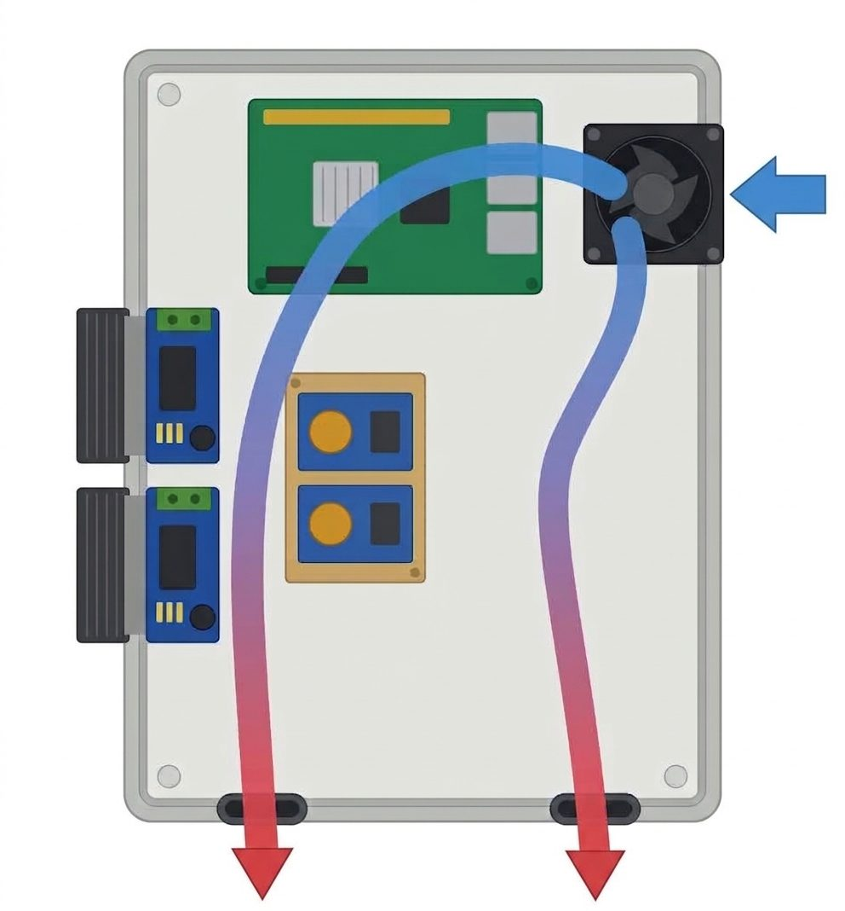

| Parámetro | Valor |
| --- | --- |
| Configuración | Overlays en `/boot/firmware/config.txt` |
| Botón de apagado | GPIO 17 (`gpio-shutdown`; sólo apaga, GPIO 3 lo ocupa el I²C de la IMU) |
| Ventilador | Sunon 5 V en GPIO 27 (`gpio-fan`), comandado con BC639 |
| Umbral | Enciende a 60 °C, histéresis 10 °C |

El botón de shutdown y el control on/off del cooler se conectan en los pines GPIO de la Raspberry, son configurados como “device tree overlays” y se los declara en `/boot/firmware/config.txt` (ruta en SO Ubuntu)





## Botón de apagado (GPIO 17)

> [!NOTE]
> Aclaración: La función de encendido es una capacidad de hardware exclusiva del GPIO 3, pero está ocupado por la comunicación I2C de la IMU, por lo tanto el botón en GPIO 17 solo apaga; y sólo se puede encender energizando la placa con el interruptor general.

Se usa el overlay `gpio-shutdown`. El GPIO se configura como entrada que genera eventos `KEY_POWER.` El evento se dispara conectando el pin a GND. El botón es normal abierto. Internamente tiene habilitado un Pull-up (~50 kΩ)

Línea a agregar en `config.txt`:

```
dtoverlay=gpio-shutdown,gpio_pin=17,active_low=1,gpio_pull=up
```

## Cooler controlado por temperatura (GPIO 27)

Cooler: **Sunon MF 5 V, 150 mA** (MagLev). Se controla con el overlay `gpio-fan`, que hace control on/off. El transistor trabaja en saturación o corte según la temperatura de la CPU.

Línea a agregar en `config.txt`:

```jsx
dtoverlay=gpio-fan,gpiopin=27,temp=60000,hyst=10000
```

temp: 60 [°C] es la temperatura de encendido; hyst: 10 [°C] es el margen antes de volverse a apagar.





> [!NOTE]
> Fuera del gabinete el micro llega a 55 - 60°C, por lo que no representa un problema, pero luego de la instalación en un gabinete estanco con unas pocas ranuras de ventilación, este valor puede subir. El umbral de thermal throttling es alrededor de 75 °C (a esta temperatura se aplicar una reducción de rendimiento).

### Verificaciones

Ver la configuración, luego de reiniciar la raspberry:

```bash
dmesg | grep fan
# salida esperada: gpio-fan gpio-fan@0: GPIO fan initialized
```

Ver estado actual: (prendido=1 ; apagado=0 )

```python
cat /sys/class/thermal/cooling_device0/cur_state
```

Forzar prendido o apagado:

```bash
echo 0 | sudo tee /sys/class/thermal/cooling_device0/cur_state
echo 1 | sudo tee /sys/class/thermal/cooling_device0/cur_state
```

Ver la temperatura en CPU

```bash
cat /sys/class/thermal/thermal_zone0/temp
# alternativa?:
vcgencmd measure_temp
# o de forma contínua: 
watch -n 1 vcgencmd measure_temp
```

### Componentes

| Componente | Características |
| --- | --- |
| **Cooler Sunon MF** | 5 V DC, 150 mA, rodamiento MagLev |
| **BC639** | BJT NPN, Ic máx = 1A, Vce máx = 80 V |
| **R base 1 kΩ** | R base del BC639. Ib ≈ (3.3 V − 0.7 V) / 1 kΩ ≈ 2.6 mA |
| **Diodo 1N4007** | *Flyback*, en paralelo con el cooler (cátodo al + del ventilador). Impide el pico de tensión inversa que genera la bobina del motor al cortar la corriente |

## Referencias

- [raspberrypi.com/documentation/computers/config_txt.html](https://www.raspberrypi.com/documentation/computers/config_txt.html)
- [github.com/raspberrypi/firmware/blob/master/boot/overlays/README](https://github.com/raspberrypi/firmware/blob/master/boot/overlays/README)
