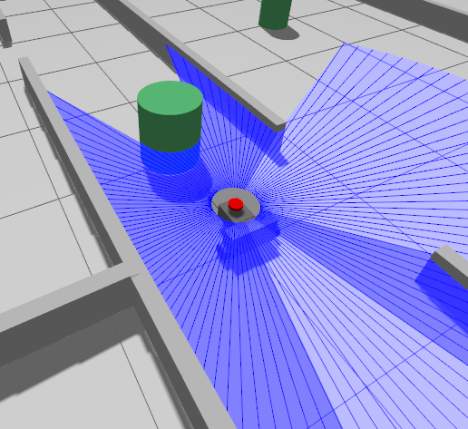
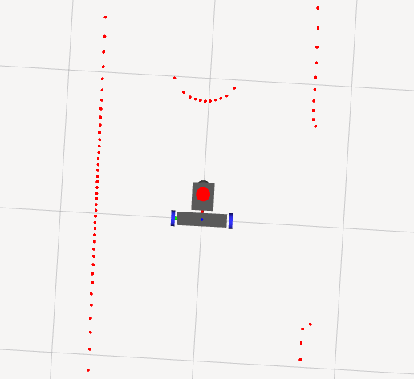
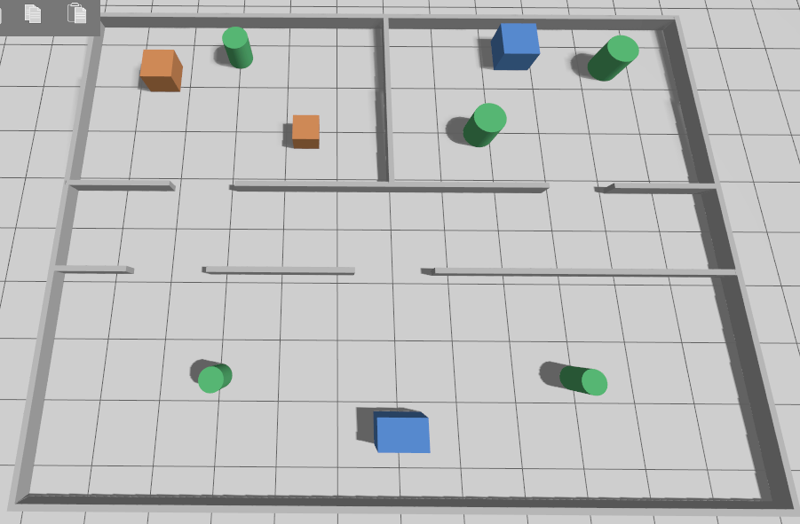

| Parámetro | Valor |
| --- | --- |
| Simulador | Gazebo Fortress (Ignition 6), nativo de Humble |
| Configuración | Mismo repo y `my_controllers.yaml` que el robot real |
| Hardware | Sólo cambia el plugin con `sim_mode` (ign_ros2_control) |
| Sensores | SDF (gpu_lidar, imu) hacia ROS por ros_gz_bridge |
| Mundo | `obstacles_gz.sdf`, sin conexión |

https://medium.com/@14sohaibbk97/get-started-with-robotic-simulations-using-ros2-and-gazebo-part-1-59e4d5d04b88

https://articulatedrobotics-xyz.translate.goog/tutorials/ready-for-ros/gazebo?_x_tr_sl=en&_x_tr_tl=es&_x_tr_hl=es&_x_tr_pto=tc&_x_tr_hist=true

https://gazebosim.org/docs/fortress/getstarted/

## ¿Qué es Gazebo?

Gazebo es un entorno de simulación de código abierto, con él podemos crear un "mundo" virtual y cargar en un modelo de nuestro robot. Los sensores simulados pueden detectar el medio ambiente y publicar los datos en los mismos topics que ROS espera leer al igual que lo harían los sensores reales. También permite aplicar fuerzas externas o ver como se desplaza nuestro robot en el suelo teniendo en cuenta aspectos físicos como la fricción.

> [!NOTE]
> Se ha migrado a una versión nueva de gazebo porque el anterior se había instalado con ROS1 al comenzar la investigación para este proyecto. Además, Gazebo Classic (V 11) llegó a su fin de ciclo de vida, lo que significa que ya no recibe parches de seguridad ni actualizaciones de errores.
Elegimos Gazebo Fortress por ser el simulador oficial y nativo asignado a la distro de Humble (ROS2). Forma parte del entorno Gazebo Modern, que anteriormente se lo renombró “Ignition”, pero actualmente volvió a llamarse Gazebo (sus binarios y plugins todavía llevan el prefijo
`ignition`/`ign` )

## Conceptos de ROS 2 y analogía con una planta de producción

ROS 2 (Robot Operating System 2) es un *middleware* para robótica; no es un sistema operativo en sí, sino la capa que coordina las partes. Para captar rápido sus conceptos centrales conviene pensar en una planta de producción (fábrica):

- Nodos - operarios: cada *nodo* es un trabajador que hace una tarea específica. Uno lee un sensor, otro controla las ruedas. Trabajan de forma independiente pero hacia un objetivo común.
- Topics - cintas transportadoras: los operarios depositan paquetes en cintas que llevan la información de un operario a otro.
- Mensajes - el contenido de los paquetes: cada paquete sobre la cinta lleva un mensaje.
- Services / Actions - Consultas rápidas vs. Órdenes de trabajo
Services: (Pregunta/Respuesta) A veces, un operario necesita una información puntual y rápida de otro. Detiene un segundo lo que está haciendo, pulsa el intercomunicador y pregunta. El otro responde al instante y ambos siguen con lo suyo.
- Actions (Orden de trabajo) se usa cuando la tarea que se solicita requiere tiempo, esfuerzo y pasos intermedios, el operario asignado acepta el encargo, va informando de cómo va el progreso y avisa cuando termina (o si surge un problema).

## Requisitos de software

- **Ubuntu 22.04 (Jammy Jellyfish)** — el SO obligatorio para Humble.
- **ROS 2 Humble Hawksbill** — distribución LTS estable.
- **Gazebo Fortress (= Ignition Gazebo 6)** — la versión de Gazebo compatible con Humble.

## Instalación

La instalación de **ROS 2 Humble** y de **Gazebo Fortress** se hace siguiendo las guías oficiales (no se reproducen acá porque cambian con el tiempo):

[ROS 2 Humble — Installation](https://docs.ros.org/en/humble/Installation.html)

[Gazebo Fortress — Install on Ubuntu](https://gazebosim.org/docs/fortress/install_ubuntu/)

Una vez instalado ROS 2, conviene agregar algunas herramientas que se usan en todo proyecto:

```bash
# colcon: el sistema de build de los paquetes ROS 2
sudo apt install python3-colcon-common-extensions

# rosdep: resuelve automáticamente dependencias de ROS 2 y Gazebo
sudo apt install python3-rosdep
sudo rosdep init
rosdep update
```

Para la integración ROS 2 / Gazebo de este proyecto se instalan, además, los meta-paquetes que traen el puente y el control:

```bash
sudo apt install ros-humble-ros-gz ros-humble-gz-ros2-control
```

- `ros-humble-ros-gz` (lanzar/spawnear),
- `ros_gz_bridge` (puente de topics gz y ROS),
- `ros-humble-gz-ros2-control` es el plugin que conecta `ros2_control` con Gazebo.

## Crear un workspace y un paquete de ROS 2

Un **workspace** es simplemente una carpeta que agrupa **paquetes**, todos dentro de una subcarpeta `src/`. No hay paquetes anidados dentro de otros ni workspaces dentro de workspaces: la jerarquía es plana (un workspace,  luego muchos paquetes independientes en `src/`).

```bash
# Crear la estructura del workspace
mkdir -p ~/ros2_ws/src
cd ~/ros2_ws
```

```
.
└── src        # acá viven todos los paquetes
```

Dentro de `src/` se crea el paquete. El comando `ros2 pkg create` arma el esqueleto:

```bash
cd ~/ros2_ws/src
ros2 pkg create mi_paquete --build-type ament_cmake --dependencies rclcpp ros_gz_sim ros_gz_bridge
```

- `--build-type`: puede ser `ament_cmake` (C++) o `ament_python` (Python). Para integrarse con Gazebo y `ros2_control` se usa **`ament_cmake`**.
- `--dependencies`: se pueden listar acá o agregarlas después en `package.xml`.

Esqueleto resultante del paquete:

```
src
└── mi_paquete
    ├── CMakeLists.txt
    ├── include
    ├── package.xml
    └── src
```

## SDF vs. xacro: dos formas de describir el robot

Acá conviene aclarar una confusión muy común al empezar, porque este proyecto usa los dos formatos:

- SDF (Simulation Description Format): es el formato nativo de Gazebo, en XML. Describe mundos completos (luz, gravedad, física, modelos) y modelos con su física de simulación. Es lo que entiende el simulador directamente.
- URDF / xacro: URDF (Unified Robot Description Format) es el formato nativo de ROS para describir el robot (links, joints, TF). xacro es URDF con “macros”: permite variables, condicionales (`<xacro:if>`) e includes, para no repetir XML y poder intercambiar bloques (p. ej. real vs. simulación). ROS, RViz, `robot_state_publisher` y `ros2_control` trabajan con URDF.

En la práctica: el mundo se escribe en SDF (`worlds/*.sdf`), mientras que el robot se describe en xacro/URDF y Gazebo lo convierte a su representación interna al introducirlo en el entorno simulado. Los sensores (lidar, IMU) y los plugins de control se inyectan dentro del xacro mediante etiquetas `<gazebo>` que contienen fragmentos SDF —por eso en este proyecto se ven sensores SDF (`gpu_lidar`, `imu`) declarados adentro de `lidar.xacro` e `imu.xacro.`

## Anatomía de un archivo SDF

Un SDF es XML (sintaxis parecida a HTML). Conviene conocer su estructura para crear mundos propios, aunque después se reutilicen mundos ya armados. Modificar un mundo de ejemplo (Gazebo trae varios instalados) es una buena forma de arrancar.

### El mundo `<world>`

Un archivo de mundo agrupa, dentro de una etiqueta `<world>`:

- `<physics>`: parámetros del motor de física: paso de integración (`max_step_size`), factor de tiempo real (`real_time_factor`), `gravity`, etc.
- System plugins: habilitan capacidades del simulador. Los obligatorios son `physics` (física), `scene-broadcaster` (poder ver la escena), `user-commands` (interactuar con la escena) y `sensors`.
- GUI plugins (opcionales): paneles de la interfaz.
- Modelos incluidos (`<include>`): típicamente un Ground Plane (piso) y un Sun (luz), más el modelo del robot. La etiqueta `<pose>` ubica cada modelo.

### El modelo `<model>` (links y joints)

Un modelo SDF (o xacro) se compone esencialmente de `<link>` (las piezas rígidas) y `<joint>` (cómo se unen). Cada link suele tener tres bloques:

- `<inertial>` — masa e inercia del link (cómo responde a fuerzas). Sin inercia coherente el cuerpo no se comporta bien físicamente.
- `<visual>` — cómo se ve el link (geometría + material/color). Es solo estético.
- `<collision>` — cómo colisiona e interactúa físicamente con otros links. Puede diferir del visual (a menudo una geometría más simple).

Cada joint une dos links y define:

- `<parent>` — el link de referencia del joint.
- `<child>` — el link que cuelga del parent (la pieza móvil/apéndice).
- `<pose>` — offset y orientación del joint. La `<pose>` usa coordenadas cartesianas `x y z` para posición y `roll pitch yaw` en radianes para orientación.

Los tipos de joint más usados son `fixed` (rígido, no se mueve) y `revolute` (rota alrededor de un eje). En un chasis con sensores, casi todos los joints sensor-chasis son `fixed`.

```xml
<!-- CASTER WHEEL LINK -->

    <joint name="caster_wheel_joint" type="fixed">
        <parent link="chassis2"/>
        <child link="caster_wheel"/>
        <origin xyz="0.156 0 -0.024"/>
    </joint>

    <link name="caster_wheel">
        <visual>
            <geometry>
                <sphere radius="0.056"/>
            </geometry>
            <material name="white">
                <color rgba="0.5 0.5 0.5 1"/>
            </material>
        </visual>
        <collision>
            <geometry>
                <sphere radius="0.056"/>
            </geometry>
        </collision>
        <xacro:inertial_sphere mass="0.02" radius="0.056">
            <origin xyz="0 0 0" rpy="0 0 0"/>
        </xacro:inertial_sphere>
    </link>
```

Extracto real del xacro del robot mostrando un `<link>` con sus tres bloques (`inertial`/`visual`/`collision`) y un `<joint type="fixed">` con `parent`/`child`/`pose`, para aterrizar estos conceptos al robot del proyecto.

## Editar `CMakeLists.txt` y `package.xml` y compilar

Estos dos archivos le dicen a ROS 2 cómo compilar e instalar el paquete. 

Debemos definir el nombre de las dependencias en estos archivos al incorporar nuevos paquetes en nuestro proyecto.  

El CMakeLists.txt organizar dependencias y directorios en el espacio de instalación: en la siguiente línea agregamos el directorio **`worlds/`:** mapas y entornos de simulación.

```python
# CMakeLists.txt
# (...)
install(
  DIRECTORY description launch config worlds
  DESTINATION share/${PROJECT_NAME}
)

ament_package()
```

```xml
<!-- package.xml -->
<!-- (...) -->

<!-- Simulación: Gazebo Fortress (Ignition Gazebo 6) -->
<exec_depend>ros_gz_sim</exec_depend>
<exec_depend>ros_gz_bridge</exec_depend>
<exec_depend>gz_ros2_control</exec_depend>
<export>
  <build_type>ament_cmake</build_type>
</export>
```

Finalmente, para compilar y ejecutar el paquete:

```bash
cd ~/ros2_ws
colcon build --symlink-install
source install/setup.bash
ros2 launch mi_paquete mi_launch.launch.py
```

## Cómo usar la interfaz gráfica de Gazebo

Una vez instalado, conviene probar las funciones con un mundo ya cargado:

### Lanzar un mundo

En Fortress el comando es `ign gazebo` (en versiones posteriores de Gazebo pasó a ser `gz sim`). Gazebo trae mundos de ejemplo instalados, por ejemplo `shapes.sdf` (seis figuras simples) o `empty.sdf` (mundo vacío):

```bash
ign gazebo shapes.sdf          # mundo de ejemplo con figuras
ign gazebo empty.sdf           # mundo vacío, para ir agregando objetos
ign gazebo shapes.sdf -v 4     # -v 4: verbose (errores, warnings, debug en consola)
ign gazebo -s shapes.sdf       # -s: solo servidor (sin GUI)
ign gazebo -g                  # -g: solo GUI (se debería conecta a un server ya corriendo)

# ejemplo mundo creado en este proyecto: 
ign gazebo ~/robotLidar/src/robot/worlds/obstacles_gz.sdf
```

Al iniciar, la simulación arranca en pausa: hay que darle *play* en la barra inferior para que corra la física.

### Navegar la escena 3D

El movimiento de cámara se hace con el mouse:

- Click izquierdo + arrastrar: panning o desplazar la cámara horizontalmente
- Click derecho + shift + arrastrar (o rueda presionada + arrastrar): orbitar / rotar la vista alrededor de la escena.
- Rueda del mouse (o Click izquierdo + arrastrar): acercar / alejar (zoom).

El panel View Angle permite saltar a vistas predefinidas (frontal, superior, lateral) respecto de la entidad seleccionada, y el botón *home* devuelve a la vista inicial con que se cargó el mundo.

### Manipular modelos (Transform Control)

La barra de herramientas arriba a la izquierda controla la transformación de entidades. Los modos (también disponibles por atajo de teclado) son:

- **Select** (modo por defecto, `Esc` para volver a él): hacer click selecciona una entidad, que se resalta en el *Entity Tree*. Con `Ctrl` + click se seleccionan varias. En este modo no se mueven los objetos.
- **Translate** (`T`): aparecen tres flechas —**roja = X, verde = Y, azul = Z**—; se arrastra una flecha para mover la entidad sobre ese eje. Mantener `X`, `Y` o `Z` (o una combinación) restringe el movimiento a esos ejes.
- **Rotate** (`R`): aparecen tres círculos —**rojo = roll, verde = pitch, azul = yaw**—; se arrastra uno para rotar sobre ese eje.
- **Snapping**: manteniendo `Ctrl` al arrastrar, el movimiento salta en incrementos fijos (por defecto 1 m en traslación y 45° en rotación), configurables desde el ícono de *snap*.

> [!TIP]
> Tras una rotación los ejes locales del objeto quedan desalineados del mundo. Manteniendo `Shift` mientras se arrastra, la traslación/rotación se hace respecto del **marco del mundo** (temporalmente, hasta soltar).

El **Align Tool** alinea un modelo respecto del *bounding box* de otro (seleccionando dos con `Ctrl` + click), útil para dejar objetos pegados o en fila.

### Inspeccionar una entidad (Component Inspector)

Seleccionando una entidad, el **Component Inspector** muestra sus atributos: pose, si es estática, si le pega el viento, además de los campos de gravedad y magnéticos del mundo. Expandiendo **Pose** se ven sus coordenadas, que se actualizan en vivo a medida que el objeto se mueve con la simulación corriendo. Es la herramienta para leer la posición exacta de algo, por ejemplo para después copiarla a un `<pose>` en el SDF.

### Agregar objetos al mundo

Hay dos caminos, según se quiera algo temporal o permanente:

1. **Desde la GUI (temporal)** — con el plugin **Resource Spawner** se insertan modelos del catálogo en línea **Fuel** ([app.gazebosim.org/fuel](http://app.gazebosim.org/fuel)). Se elige un modelo, se lo arrastra a la escena y se lo ubica con las herramientas de *Transform Control*. Esto vale para probar, pero no queda guardado al cerrar.
2. **En el archivo SDF (permanente)** — para que el objeto forme parte del mundo siempre, se agrega al `.sdf`. En la página del modelo en Fuel, el botón **`<>`** copia un *snippet* SDF listo para pegar dentro del `<world>`; el botón de descarga baja el modelo completo. Las figuras básicas (caja, esfera, cilindro) también se pueden escribir a mano como un `<model>` con su `<link>` (ver “Crear mundos: anatomía de un archivo SDF” más arriba).

```xml
<!-- Objeto traído de Fuel, pegado dentro de <world> -->
<include>
    <uri>https://fuel.gazebosim.org/1.0/OpenRobotics/models/Mine Cart Engine</uri>
    <pose>2 0 0 0 0 0</pose>   <!-- x y z roll pitch yaw -->
</include>
```

> [!NOTE]
> Para un mundo que cargue **sin conexión** (como el de este proyecto), conviene evitar `<include>` apuntando a URLs de Fuel y, en cambio, definir los obstáculos directamente como `<model>` dentro del SDF. Así el mundo es *self-contained*.

> [!NOTE]
> Referencia de redacción y más detalle sobre agregar objetos (en Gazebo Classic, pero el concepto es el mismo): [Simulating with Gazebo — Adding objects | Articulated Robotics](https://articulatedrobotics.xyz/tutorials/ready-for-ros/gazebo/#adding-objects). Documentación oficial Fortress: [Manipulating Models](https://gazebosim.org/docs/fortress/manipulating_models/) · [Model Insertion from Fuel](https://gazebosim.org/docs/fortress/fuel_insert/).

---

## Características y pequeña guía

- **Arquitectura**: servidor (física + sensores) + GUI unificados bajo el comando
`ign gazebo`. Headless = `s` (solo server); `r` = correr al iniciar (sin darle
play a mano); `v4` = verbose.
- **Transport propio**: Gazebo usa **gz-transport**, su propio middleware, **NO DDS
de ROS**. Por eso los sensores y el reloj **no aparecen en ROS automáticamente**:
hace falta `ros_gz_bridge` (ver abajo). El control sí entra por ROS porque
`gz_ros2_control` levanta un `controller_manager` ROS adentro de Gazebo.
- **GUI** (paneles útiles):
    - *Entity tree* — árbol de modelos/links del mundo.
    - *Component inspector* — pose, inercia, etc. de la entidad seleccionada.
    - Barra inferior: **play/pause/step** de la simulación y reloj (RTF, sim time).
    - Botones de *view*: colisiones, inercias, frames, wireframe (útil para depurar
    geometría, p. ej. ver si el láser roza el chasis).

---

## El papel de `ros2_control.xacro` vs `gazebo_control.xacro`

Estos dos archivos son el corazón de la paridad sim/real.

**`ros2_control.xacro`** — define el bloque `<ros2_control>` (joints + interfaces de
comando/estado) y, sobre todo, **qué plugin de hardware** se usa. Se intercambia con
un arg `sim_mode`:

```xml
<xacro:unless value="$(arg sim_mode)">
    <plugin>diffdrive_arduino/DiffDriveArduinoHardware</plugin>   <!-- robot real -->
</xacro:unless>
<xacro:if value="$(arg sim_mode)">
    <plugin>ign_ros2_control/IgnitionSystem</plugin>              <!-- simulación -->
</xacro:if>
```

Los `<joint>` y sus interfaces son **idénticos** en ambos modos: por eso
`diff_cont` (diff_drive_controller) y `joint_broad` y `my_controllers.yaml` se
reutilizan tal cual.

**`gazebo_control.xacro`** — se incluye **solo en sim** (`<xacro:if sim_mode>`).
Carga el *system plugin* que mete un `controller_manager` **dentro** de Gazebo,
apuntando a la misma config de controllers:

```xml
<gazebo>
    <plugin filename="ign_ros2_control-system"
            name="ign_ros2_control::IgnitionROS2ControlPlugin">
        <parameters>$(find robot)/config/my_controllers.yaml</parameters>
    </plugin>
</gazebo>
```

En una frase: **`ros2_control.xacro` decide el “hardware” (real vs sim);
`gazebo_control.xacro` arranca la maquinaria de control adentro de Gazebo.**

> [!NOTE]
> La fricción del caster (`<gazebo reference="caster_wheel"><mu1>`) vive en
`robot_core.xacro` junto al link; sin ella la rueda loca esférica arrastra y
bloquea los giros.

---

## Los plugins de `imu.xacro` y `lidar.xacro`

No son plugins de ROS: son **sensores SDF nativos de Gazebo**. El *system plugin*`Sensors` del mundo los ejecuta y publica sus datos a **gz-transport** (no a ROS).

```xml
<!-- lidar.xacro -->
<sensor name="laser" type="gpu_lidar">
    <topic>scan</topic>
    <ignition_frame_id>laser_frame</ignition_frame_id>
    ...
</sensor>

<!-- imu.xacro -->
<sensor name="imu_sensor" type="imu">
    <topic>imu/data_raw</topic>
    <ignition_frame_id>imu_frame</ignition_frame_id>
</sensor>
```

- `type="gpu_lidar"` / `type="imu"` → sensores que provee Fortress.
- `<topic>` → en qué topic de **gz** publican.
- `<ignition_frame_id>` → fija el `frame_id` del mensaje (clave para que SLAM/Nav2
encuentren la TF correcta).
- Para que esos datos lleguen a ROS, el **bridge** los traduce (`scan` → `/scan`,
`imu/data_raw` → `/imu/data_raw`).

---

## Cómo llegan los datos a ROS: el bridge

```
Gazebo (gz-transport)                          ROS 2 (DDS)
  /clock ───────────┐
  scan   ───────────┼──►  ros_gz_bridge  ──►   /clock  /scan  /imu/data_raw
  imu/data_raw ─────┘     (parameter_bridge)

  gz_ros2_control (controller_manager ROS) ──► /diff_cont/odom, /joint_states, cmd_vel
```

- **Sensores y reloj**: van por el bridge. El `/clock` es imprescindible para que
todos los nodos ROS con `use_sim_time:=true` usen el tiempo de simulación.
- **Control y odometría**: NO necesitan bridge — `gz_ros2_control` ya expone
`diff_cont`/`joint_broad` como nodos ROS normales. `cmd_vel` entra directo al
controller. El EKF y twist_mux corren nativos en ROS, igual que en el real.

---

## Qué cambios hicieron falta en el proyecto

Conceptos (no exhaustivo — git tiene el detalle):

1. **Arg `sim_mode`** en `robot.urdf.xacro` / `ros2_control.xacro` para intercambiar
el plugin de hardware (real ↔︎ `IgnitionSystem`) e incluir `gazebo_control.xacro`
solo en sim.
2. **Sensores SDF** en `lidar.xacro` e `imu.xacro` (gpu_lidar / imu) publicando a
gz-transport.
3. **Mundo Fortress** (`worlds/obstacles_gz.sdf`, SDF 1.8) con los *system plugins*
obligatorios: `physics`, `sensors`, `scene-broadcaster`, `user-commands`. Sin
ellos no hay física ni sensores. Se hizo self-contained (sin modelos de Fuel)
para que cargue offline.
4. **`launch_sim.launch.py`**: arranca `gz_sim` con el mundo, spawnea el robot con
`ros_gz_sim create -topic robot_description`, levanta el `ros_gz_bridge`
(clock/scan/imu), los spawners de controllers, twist_mux y el EKF — todo con
`use_sim_time:=true`.
5. **`use_sim_time` parametrizable** en `slam_nav.launch.py` y `explore.launch.py`
(default `false`; en sim se pasa `:=true`) para que SLAM, Nav2 y explore_lite
compartan el reloj de simulación.

---

## Cómo correr

```bash
# 1. Simulación (Gazebo + robot + controllers + bridge + EKF)
ros2 launch robot launch_sim.launch.py

# 2. SLAM + Nav2 con reloj de simulación
ros2 launch robot slam_nav.launch.py use_sim_time:=true

# 3. Exploración autónoma
ros2 launch robot explore.launch.py use_sim_time:=true
```







Para correrlo en Windows: [Simulaciones en Windows con WSL2](./windows-wsl2.md) (asignar ~8 GB de RAM a WSL2).

## Referencias

- [medium.com/@14sohaibbk97/get-started-with-robotic-simulations-using-ros2-and-gazebo-part-1](https://medium.com/@14sohaibbk97/get-started-with-robotic-simulations-using-ros2-and-gazebo-part-1-59e4d5d04b88)
- [articulatedrobotics.xyz/tutorials/ready-for-ros/gazebo](https://articulatedrobotics.xyz/tutorials/ready-for-ros/gazebo/)
- [gazebosim.org/docs/fortress/getstarted](https://gazebosim.org/docs/fortress/getstarted/)
- [docs.ros.org/en/humble/Installation.html](https://docs.ros.org/en/humble/Installation.html)
- [gazebosim.org/docs/fortress/install_ubuntu](https://gazebosim.org/docs/fortress/install_ubuntu/)
- [app.gazebosim.org/fuel](http://app.gazebosim.org/fuel)
- [gazebosim.org/docs/fortress/manipulating_models](https://gazebosim.org/docs/fortress/manipulating_models/)
- [gazebosim.org/docs/fortress/fuel_insert](https://gazebosim.org/docs/fortress/fuel_insert/)
