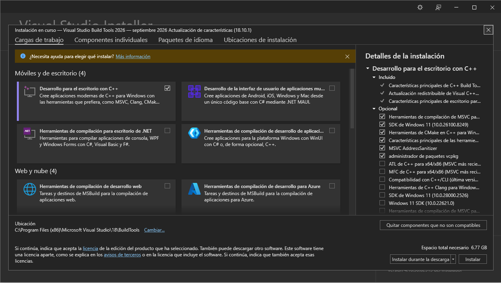
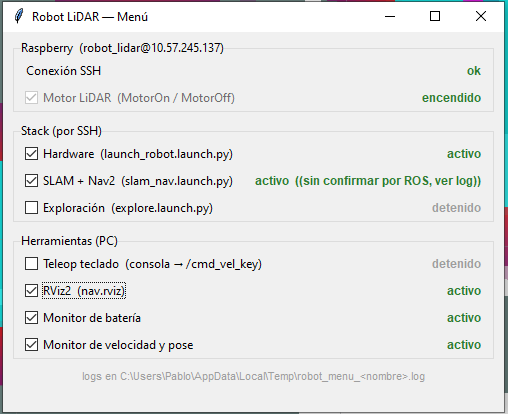

##### Qué es RoboStack y cómo funciona

[Getting Started | RoboStack](https://robostack.github.io/GettingStarted.html)

[RoboStack/ros-humble: Recipes for ROS 2 Humble Hawksbill](https://github.com/RoboStack/ros-humble)

[https://youtube.com/playlist?list=PLJ18jaEFbsWiCfrbczEoDTXqhpdsZJfjc&si=uTT_iOZTGGDSZfUK](https://youtube.com/playlist?list=PLJ18jaEFbsWiCfrbczEoDTXqhpdsZJfjc&si=uTT_iOZTGGDSZfUK) 

RoboStack es una distribución de ROS empaquetada sobre **conda**, un gestor de paquetes multiplataforma originado en el ecosistema científico de Python. El proyecto toma el código fuente de las distribuciones oficiales de ROS y lo compila para plataformas que la distribución oficial no cubre bien, entre ellas Windows o macOS, publicando el resultado como paquetes binarios precompilados.

El mecanismo de funcionamiento se apoya en tres piezas:

1. **Canales de paquetes.** Cada distribución de ROS tiene su propio canal (`robostack-humble`, `robostack-jazzy`, etc.) desde donde se descargan los binarios ya compilados. No hay compilación local.
2. **Entornos aislados.** Toda la instalación vive dentro de una carpeta del proyecto. No se escribe en el registro de Windows ni en directorios del sistema, no requiere privilegios de administrador y es reversible borrando la carpeta.
3. **Pixi como gestor.** Pixi lee un archivo declarativo `pixi.toml` (qué distro, qué paquetes, qué variables de entorno) y genera un `pixi.lock` con las versiones exactas instaladas. Esto hace el entorno **reproducible**: otra persona clona los dos archivos y obtiene un entorno idéntico, lo cual es relevante para la reproducibilidad del trabajo. [Home](https://pixi.prefix.dev/latest/)

Desde el punto de vista de la red, el aspecto decisivo es que rviz2 se ejecuta como **proceso nativo del host**: utiliza directamente la interfaz de red de Windows y por lo tanto comparte la subred de la Raspberry Pi, sin capas de traducción intermedias.

##### Justificación de la elección

El objetivo planteado es ejecutar RViz2 sobre Windows para visualizar los datos publicados por el robot mediante la red local. ROS 2 utiliza DDS como middleware de comunicación, que descubre nodos remotos mediante **multicast UDP** y requiere tráfico **bidireccional** entre los participantes.

##### Soluciones descartadas:

**WSL2.** 

El entorno WSL2 ya estaba implementado y operativo para las tareas de simulación, por lo que era el candidato natural. Sin embargo, WSL2 en su modo de red por defecto (*NAT*) ubica a la máquina virtual en una subred propia (172.x.x.x) detrás de un router virtual: el tráfico saliente hacia la Raspberry Pi funciona, pero la Pi no dispone de ruta de retorno hacia la instancia de WSL. La solución prevista por Microsoft es el modo de red **Mirrored**, que hace que WSL comparta las interfaces del host. Al intentar activarlo, el sistema devolvió:

> [!NOTE]
> `wsl: No se admite el modo de red reflejada: Versión 19045 de Windows. 6466 no tiene las características necesarias. Revirtiendo a las redes NAT.`

El modo Mirrored requiere Windows 11 22H2 (build 22621) o superior y los equipos de trabajo operan sobre Windows 10, como no se planifica migrar de SO por el momento se invalidó esta solución.

[https://learn.microsoft.com/en-us/windows/wsl/networking](https://learn.microsoft.com/en-us/windows/wsl/networking)

**Docker.** 

Docker Desktop sobre Windows utiliza WSL2 como backend de virtualización, de modo que hereda exactamente la misma limitación de NAT.

**Máquina virtual.**

Una VM de VirtualBox o VMware configurada con **adaptador puente (bridged)** habría funcionado: en ese modo la VM obtiene una dirección IP propia dentro de la LAN física y es indistinguible de un equipo más de la red. La limitación de la VM es la aceleración gráfica para RViz2 que es una aplicación de renderizado 3D. A esto se suma el costo en recursos de mantener un Ubuntu completo en memoria para ejecutar una única herramienta de visualización.

##### Otras alternativas consideradas

Se evaluaron dos visualizadores alternativos que resuelven el problema de red por una vía distinta: en lugar de hablar DDS directamente, se conectan a un puente (`foxglove_bridge` o `rosbridge_suite`) ejecutándose en la Raspberry Pi mediante un **WebSocket sobre TCP**, protocolo que sí atraviesa NAT sin configuración adicional.

- **Foxglove** — se ejecuta en el navegador web, sin instalación. Conexión a `ws://<ip_de_la_pi>:8765`.
- **Lichtblick** — aplicación de escritorio, *fork* open source de Foxglove Studio mantenido por Bosch tras el cierre del código original.

---

<details>
<summary>0. Opcional: Visual Studio Community o en su defecto VS herramientas de compilación de windows (VS Build Tools)</summary>

Es una instalación opcional para compilar paquetes ROS propios con colcon en Windows. Es opcional ya que rviz2 y todo lo necesario para comandos ros2 viene precompilado y las librerías de runtime de MSVC las trae conda como dependencia.

Para la instalación se debe tildar Desarrollo para el escritorio con C++



</details>

##### 1. Instalar pixi

[https://youtu.be/-ywpmxbb8_A?si=hSyj5S6pGW9P_rzO](https://youtu.be/-ywpmxbb8_A?si=hSyj5S6pGW9P_rzO)

Sobre PowerShell normal (no hace falta admin):

```powershell
irm -useb https://pixi.sh/install.ps1 | iex
```

Cerrar y reabrir PowerShell. Verificar con pixi --version

##### 2. Crear el workspace

```powershell
cd C:\
pixi init ros_ws --channel https://prefix.dev/robostack-humble
cd ros_ws
```

Esto crea `C:\ros_ws` con un archivo `pixi.toml` adentro que contiene la configuración del workspace

##### 3. Instalar ROS 2 y el middleware que usa la Pi

Previamente añadir el canal "conda-forge" al archivo pixi.toml

```
channels = ["robostack-humble", "conda-forge"]
```

Descargar ros humble desktop (~1-2 GB) incluye rviz2:

```powershell
pixi add ros-humble-desktop ros-humble-rmw-cyclonedds-cpp
```

El segundo paquete es el middleware Cyclone DDS, que debe coincidir con el que utiliza la Raspberry Pi.

##### 4. Probar que abre

```powershell
pixi run rviz2
```

Aquí Debería levantar la ventana de RViz2 vacía, luego puede aparecer alguna ventana de firewall para permitir la conexión de la aplicación.

##### 5. Configurar la interfaz de red de Cyclone DDS (solución al conflicto con WSL2)

El equipo de trabajo, por tener WSL2 e Hyper-V instalados, presenta varios adaptadores virtuales activos además del físico, por lo que hay que declarar explícitamente la interfaz Wi-Fi mediante un archivo de configuración XML:

Crear el archivo `C:\ros_ws\cyclonedds.xml` con el siguiente contenido:

```xml
<?xml version="1.0" encoding="UTF-8" ?>
<CycloneDDS xmlns="https://cdds.io/config">
  <Domain id="any">
    <General>
      <Interfaces>
        <NetworkInterface name="Wi-Fi" priority="10" presence_required="false"/>
        <NetworkInterface name="Ethernet" priority="5" presence_required="false"/>
      </Interfaces>
    </General>
  </Domain>
</CycloneDDS>
```

Los nombres deben coincidir con los que muestra `ipconfig`.

[https://cyclonedds.io/docs/cyclonedds/latest/config/index.html](https://cyclonedds.io/docs/cyclonedds/latest/config/index.html)

#### 6. Fijar las variables de entorno

Abrir `C:\ros_ws\pixi.toml` y agregar al final:

```toml
[activation.env]
RMW_IMPLEMENTATION = "rmw_cyclonedds_cpp"
ROS_DOMAIN_ID = "0"
ROS_LOCALHOST_ONLY = "0"
CYCLONEDDS_URI = "file://C:/ros_ws/cyclonedds.xml"
```

`ROS_DOMAIN_ID` debe coincidir con el de la Raspberry Pi; si nunca se configuró, el valor por defecto es `0` en ambos equipos. Declararlas aquí evita tener que exportarlas manualmente en cada sesión: pixi las aplica automáticamente al activar el entorno.

#### 7. Asentar los cambios

Las variables de entorno se leen al crear el proceso, de modo que cualquier proceso ya en ejecución conserva la configuración anterior. Esto afecta especialmente al **daemon de ROS 2**, un proceso en segundo plano que cachea el grafo de nodos.

```powershell
exit                 # salir del pixi shell si estaba activo
pixi shell           # reactivar el entorno con la configuración nueva
ros2 daemon stop     # forzar el reinicio del daemon
```

Verificar que las variables se aplicaron:

```powershell
echo $env:RMW_IMPLEMENTATION
echo $env:CYCLONEDDS_URI
```

> [!NOTE]
> **Regla práctica:** ejecutar `ros2 daemon stop` después de cada cambio de configuración. Durante la depuración también puede usarse `ros2 topic list --no-daemon`, que consulta la red directamente sin pasar por la caché —más lento, pero siempre refleja el estado real.

#### 8. Verificar la conexión

Con el láser corriendo en la Raspberry Pi:

```powershell
pixi run ros2 node list      # deberían verse los nodos de la Pi
pixi run ros2 topic list     # debería aparecer /scan
pixi run ros2 topic hz /scan # debería imprimir la frecuencia de publicación
```

#### 9. Visualizar

```powershell
pixi run rviz2
```

#### 4.2 Pasos para configurar una regla de entrada de firewall en windows 10 (en caso de requerir)

1. Menú Inicio → escribir "Firewall y protección de red" → Configuración avanzada
2. En el panel izquierdo: **Reglas de entrada**.
3. Panel derecho: **Nueva regla...**
4. Tipo: **Puerto** → Siguiente.
5. Marcar **UDP** y en "Puertos locales específicos" escribir 7400-7600 → Siguiente.
6. **Permitir la conexión** → Siguiente.
7. Dejar tildado solo **Privado** (destildar Dominio y Público) → Siguiente.
8. Nombre: `ROS2 DDS Discovery` → Finalizar.

---

---

### Ejecución de nodos de interfaz gráfica en Windows

Aprovechando la conexión ya establecida con la Raspberry Pi. El objetivo ahora es ejecutar en Windows los nodos del proyecto que son interfaces gráficas, como el monitor de batería.

#### Camino corto: ejecutar el script directamente

El nodo es un archivo único `.py` que depende solamente de Tkinter, no hace falta clonar el repositorio completo, ni compilar, ni instalar Visual Studio. Basta con copiar el archivo al workspace y ejecutarlo dentro del entorno:

```powershell
cd C:\ros_ws
pixi run python battery_monitor.py
```

`pixi run` activa el entorno para ese único comando, de modo que tampoco es necesario entrar al `pixi shell`. El nodo se comunica por DDS exactamente igual que si se hubiera lanzado con `ros2 run`, utilizando la configuración de red establecida en la primera parte.

> [!NOTE]
> Tkinter viene incluido en el intérprete de Python que instala conda, por lo que no requiere instalación adicional. Puede verificarse con `pixi run python -c "import tkinter; print(tkinter.TkVersion)"`.

---

### Camino largo: clonar y compilar el paquete (no se pudo ejecutar)

Este procedimiento no permitió ejecutar el nodo por diferencias no resueltas entre Linux y Windows. La vía anterior resultó más directa y es la que se adoptó.

Tiene sentido recorrerlo cuando se busca disponer de los archivos launch, las configuraciones de RViz2 y la descripción URDF del repositorio dentro del entorno de Windows.

#### 1. Instalar git en el entorno

Saltear si ya se instaló Git. Si no se cuenta con Git para Windows se puede instalar en el entorno de `ros_ws`:

```powershell
cd C:\ros_ws
pixi add git
```

#### 2. Clonar el repositorio como `src`

El repositorio es en sí mismo la carpeta `src` del workspace:

```powershell
git clone https://github.com/pablem/2025-LidarRobot.git src
```

Queda en `C:\ros_ws\src\robot\`, `C:\ros_ws\src\serial\`, etc.

Conviene mantener corta la ruta del workspace: colcon genera rutas de compilación muy extensas y en Windows puede alcanzarse el límite de 260 caracteres del sistema de archivos.

#### 3. Excluir los paquetes que no compilan

La mayoría de los paquetes del repositorio son específicos de Linux y del hardware del robot: `serial` utiliza termios (API POSIX), `diffdrive_arduino` depende de esa librería, `mpu9250driver` requiere libi2c y `xv_11_laser_driver` accede a puertos serie de Linux. Ninguno es necesario para una interfaz gráfica.

Un archivo vacío llamado `COLCON_IGNORE` hace que colcon saltee esa carpeta:

```powershell
cd C:\ros_ws\src
ni serial\COLCON_IGNORE -ItemType File
ni diffdrive_arduino\COLCON_IGNORE -ItemType File
ni mpu9250driver\COLCON_IGNORE -ItemType File
ni xv_11_laser_driver\COLCON_IGNORE -ItemType File
ni m-explore-ros2\COLCON_IGNORE -ItemType File
cd C:\ros_ws
```

Agregar `COLCON_IGNORE` al `.gitignore` para que estos archivos no se versionen y no afecten la compilación en la RP4.

#### 4. Compilar solo el paquete `robot`

El paquete `robot` declara `<build_type>ament_cmake</build_type>`, de modo que colcon invoca CMake y CMake exige un compilador configurado. Es necesario instalar **Visual Studio Build Tools** con la carga de trabajo *Desarrollo para el escritorio con C++*.

```powershell
pixi add ros-dev-tools
```

La compilación debe ejecutarse desde la consola **x64 Native Tools Command Prompt for VS**, que es la que define la variable de entorno `VisualStudioVersion`. Desde PowerShell normal falla con el mensaje *"VisualStudioVersion is not set, please run within a Visual Studio Command Prompt"*.

```bash
cd C:\ros_ws
pixi run colcon build --merge-install --packages-select robot
```

La opción `--merge-install` reúne todos los artefactos en un único directorio en lugar de uno por paquete, lo que evita que la variable `PATH` crezca hasta volverse inmanejable en Windows.

> [!NOTE]
> Durante la compilación aparece una advertencia de CMake sobre `cmake_minimum_required(VERSION 3.8)`. Es informativa —anuncia que las versiones futuras dejarán de admitir políticas anteriores a 3.10— y no afecta el resultado. Puede silenciarse cambiando la primera línea del `CMakeLists.txt` por `cmake_minimum_required(VERSION 3.8...3.28)`, sintaxis válida también en la Raspberry Pi.

#### 5. Activar el workspace compilado

Agregar al `pixi.toml`:

```toml
[target.win.activation]
scripts = ["install/setup.bat"]
```

Salir y entrar al shell para que se aplique:

```powershell
exit
pixi shell
ros2 daemon stop
```

#### Limitación encontrada

Con el workspace compilado y activado, el paquete se localiza correctamente, pero la ejecución del nodo falla:

```
ros2 run robot battery_monitor
OSError: [WinError 193] %1 no es una aplicación Win32 válida
```

La causa está en cómo el `CMakeLists.txt` instala los scripts Python:

```
install(PROGRAMS
  scripts/battery_monitor.py
  DESTINATION lib/${PROJECT_NAME}
  RENAME battery_monitor
)
```

El `RENAME` elimina la extensión `.py`. En Linux esto funciona porque el kernel lee la línea *shebang* (`#!/usr/bin/env python3`) y resuelve con qué intérprete ejecutar el archivo. Windows no implementa ese mecanismo: un archivo sin extensión reconocida no es ejecutable para el sistema operativo, y `CreateProcess` lo rechaza.

Cabe destacar que el error se produce en el último paso, al lanzar el proceso. La compilación selectiva, la exclusión de paquetes incompatibles y la activación del workspace funcionaron correctamente: la limitación es del mecanismo de instalación de scripts de `ament_cmake`, no del entorno de RoboStack.

#### Solución para nodos de interfaz futuros

Para los nodos de visualización que se incorporen en adelante, la forma portable es agruparlos en un paquete de tipo `ament_python` independiente:

```powershell
pixi run ros2 pkg create --build-type ament_python --destination-directory src robot_gui
```

Los nodos se declaran en su `setup.py`:

```python
entry_points={
    'console_scripts': [
        'battery_monitor = robot_gui.battery_monitor:main',
    ],
},
```

A partir de esa única declaración, `ament_python` genera un envoltorio `.exe` en Windows y un script con shebang en Linux. Con ello `ros2 run robot_gui battery_monitor` y los archivos launch funcionan de forma idéntica en ambos sistemas.

Esta organización tiene además una justificación de diseño: deja `robot` como paquete de recursos y descripción del robot, y concentra en `robot_gui` los nodos de visualización multiplataforma, separando lo que se ejecuta en la Raspberry Pi de lo que se ejecuta en la estación de trabajo.

---

---

## Nuevo menu GUI en Windows y Linux

Con esta nueva ventaja en mente: ejecutar interfaces gráficas con un sólo script de python que se puedan ejecutar en ambas plataformas, se creó un menú capaz de conectarse por ssh y lanzar los nodos y aplicaciones de interés desde una sola ventana.

```powershell
pixi run python src\robot\scripts\robot_menu.py --ros-args -p ssh_host:=robot_lidar@10.57.245.137 -p ssh_password:=pi
```



Los comandos que envía cada casilla son:

**En Raspberry:**

- *Motor LiDAR*: `printf 'MotorOn\n' > <puerto del LiDAR>` (o `MotorOff`) por SSH — enciende o apaga el motor del sensor Neato XV-11.

**Funcionamiento principal:**

- *Hardware*: `ros2 launch robot launch_robot.launch.py` — lanza drivers: motores, LiDAR e IMU con calibración inicial.
- *SLAM + Nav2*: `ros2 launch robot slam_nav.launch.py` — mapeo y navegación.
- *Exploración*: `ros2 launch robot explore.launch.py` — undock, exploración autónoma de fronteras y regreso a base.

**Herramientas locales**

- *Teleop teclado*: `ros2 run teleop_twist_keyboard teleop_twist_keyboard --ros-args -r /cmd_vel:=/cmd_vel_key` — control manual por teclado en una consola aparte.
- *RViz2*: `rviz2 -d nav.rviz` — visualización del mapa, sensores y navegación.
- *Monitor de batería*: `ros2 run robot battery_monitor` — voltaje y autonomía estimada.
- *Monitor de velocidad y pose*: muestra velocidad lineal/angular y la posición del robot en los frames odom y map.

Destildar una casilla envía la señal de corte equivalente a un Ctrl+C.

### Forma de trabajo: vibe coding

El desarrollo de este menú se llevó adelante bajo la modalidad de "vibe coding": en lugar de escribir el código a mano línea por línea, se trabajó en conversación continua con un asistente de IA (Claude Code), describiendo en lenguaje natural la funcionalidad deseada y dejando que el asistente proponga e implemente los cambios directamente sobre el repositorio. Cada iteración se probó con el robot funcionando y cada resultado obtenido se usó para el siguiente ajuste, repitiendo el ciclo hasta llegar a una versión estable del menú. 

 

 ****

## Referencias

- [robostack.github.io/GettingStarted.html](https://robostack.github.io/GettingStarted.html)
- [github.com/RoboStack/ros-humble](https://github.com/RoboStack/ros-humble)
- [learn.microsoft.com/en-us/windows/wsl/networking](https://learn.microsoft.com/en-us/windows/wsl/networking)
- [cyclonedds.io/docs/cyclonedds/latest/config/index.html](https://cyclonedds.io/docs/cyclonedds/latest/config/index.html)
