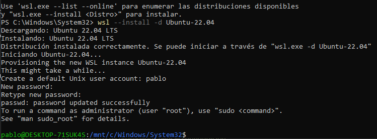
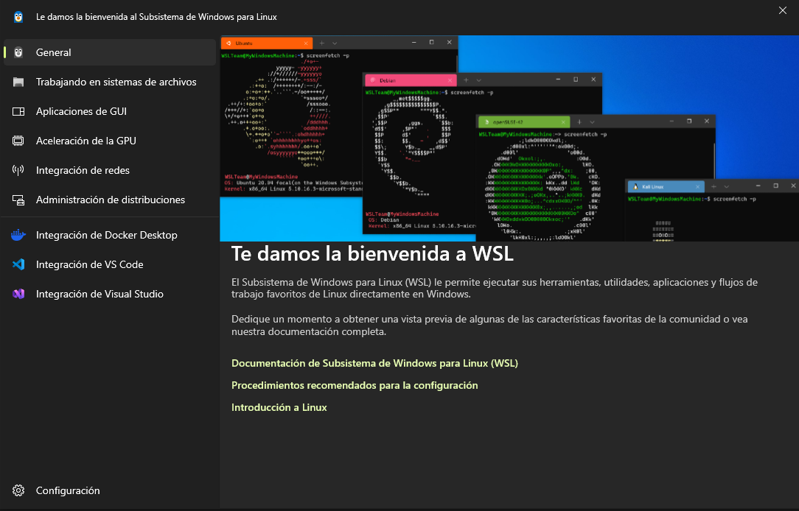
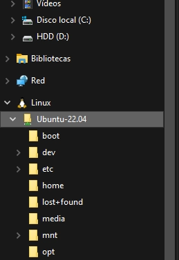

https://learn.microsoft.com/en-us/windows/wsl/install
https://learn.microsoft.com/es-es/windows/wsl/install-manual
https://ubuntu.com/wsl/docs/latest/howto/install-ubuntu-wsl2/

https://www.youtube.com/watch?v=Go9h0XVvar0

https://learn.microsoft.com/es-es/windows/wsl/
https://learn.microsoft.com/es-es/windows/wsl/setup/environment

## Instalación de WSL2

Si bien Windows 10 trae la versión por defecto WSL, nosotros necesitamos actualizar a la versión WSL2. Requisitos del sistema: versión de Windows 10 build 19044 o superior (21H2+). Para ver: Win+R y  escribir 'winver’

1. Activar / verificar que estén activas las características de Windows: 
    - **Microsoft-Windows-Subsystem-Linux**: permite correr Linux.
    - **VirtualMachinePlatform**: capa de virtualización ligera que WSL2 usa para arrancar su kernel Linux.

Para ello ejecutar como administrador en consola los siguientes comandos y luego REINICIAR 

```bash
dism.exe /online /enable-feature /featurename:Microsoft-Windows-Subsystem-Linux /all /norestart
dism.exe /online /enable-feature /featurename:VirtualMachinePlatform /all /norestart
```

Donde: /online = aplica al Windows en ejecución. /norestart = no reinicia automáticamente (por eso requiere reiniciar manualmente después). 

1. Instalar el paquete de actualización de WSL2 desde la página oficial (es un .msi) hacer doble click en el archivo descargado: wsl_update_x64.msi, link de descarga en: [Pasos de instalación manuales para versiones anteriores de WSL | Microsoft Learn](https://learn.microsoft.com/es-es/windows/wsl/install-manual#step-4---download-the-linux-kernel-update-package)  
    
    (alternativa no probada: `wsl --update --web-download` cubre pasos 2, 3 y 4 )
    
2. Establecer WSL 2 como versión predeterminada:

```bash
wsl --set-default-version 2
```

1. Actualizar la versión instalada: 

```bash
wsl --update
```

1. Verificar la versión 

```bash
wsl --version
#Versión de WSL: 2.7.10.0
#Versión de kernel: 6.18.33.2-2
#Versión de WSLg: 1.0.73.2
#Versión de MSRDC: 1.2.6676
#Versión de Direct3D: 1.611.1-81528511
#Versión de DXCore: 10.0.26100.1-240331-1435.ge-release
#Versión de Windows: 10.0.19045.6466
```

### Instalación de Ubuntu 22.04 LTS

```bash
wsl --install -d Ubuntu-22.04
```

Indicar Nombre de usuario y pass para el nuevo sistema; es la contraseña que se usará para comandos de administrador (sudo), luego para posicionarse en home: `cd ~` y para salir: `exit` 



Luego es habitual hacer:

```bash
sudo apt update && sudo apt upgrade -y
```

al finalizar se abre la interfaz con algunas configuraciones, aquí se pueden modificar los recursos asignados, integración de redes, manual de integración con VSC, entre otras:



[Documentación WSL](https://learn.microsoft.com/es-es/windows/wsl/)
[Configurar entorno de desarrollo (primeros pasos)](https://learn.microsoft.com/es-es/windows/wsl/setup/environment)

Ubuntu vive en un disco virtual (ext4.vhdx) en C, crece bajo demanda a medida que se instalan componentes, arranca en ~6 GB y va creciendo. Por defecto WSL2 toma hasta el 50% de la RAM total y todos los núcleos de CPU, pero solo usa lo que necesita en el momento (la RAM se libera al cerrar)



Cómo desinstalar Ubuntu:

```bash
wsl --list --verbose            # ver distros instaladas
wsl --unregister Ubuntu-22.04   # borra la distro y su disco (ext4.vhdx)
```

---

## ⚡ Instalación rápida con un script

A continuación se detalla la instalación manual paso a paso de ROS + Robot Lidar 2026. Pero el repositorio incluye `setup_robotlidar.sh` en su raíz para hacerlo de forma automática (se pueden saltear los siguientes pasos hasta antes de las simulaciones)

Para ello, dentro de Ubuntu, se clona el proyecto y ejecuta el script:

```bash
cd ~ 
git clone https://github.com/pablem/2025-LidarRobot.git
bash 2025-LidarRobot/setup_robotlidar.sh
```

Al terminar, abrir una terminal nueva (o `source ~/.bashrc`) y probar los tests de simulaciones (al final del documento)

---

## Instalación paso a paso

### Instalación de ROS2

1. Tutorial de [ros.org](http://ros.org) 

[Ubuntu (deb packages) — ROS 2 Documentation: Humble documentation](https://docs.ros.org/en/humble/Installation/Ubuntu-Install-Debs.html)

```bash
# Locale
sudo apt update && sudo apt install -y locales
sudo locale-gen en_US en_US.UTF-8
sudo update-locale LC_ALL=en_US.UTF-8 LANG=en_US.UTF-8
export LANG=en_US.UTF-8

# Habilitar Ubuntu Universe repository
sudo apt install software-properties-common -y
sudo add-apt-repository universe -y

# Descargar y configurar repositorio ROS2
sudo apt update && sudo apt install curl -y
export ROS_APT_SOURCE_VERSION=$(curl -s https://api.github.com/repos/ros-infrastructure/ros-apt-source/releases/latest | grep -F "tag_name" | awk -F'"' '{print $4}')
curl -L -o /tmp/ros2-apt-source.deb "https://github.com/ros-infrastructure/ros-apt-source/releases/download/${ROS_APT_SOURCE_VERSION}/ros2-apt-source_${ROS_APT_SOURCE_VERSION}.$(. /etc/os-release && echo ${UBUNTU_CODENAME:-${VERSION_CODENAME}})_all.deb"
sudo dpkg -i /tmp/ros2-apt-source.deb

# Instalación
sudo apt update
sudo apt install -y ros-humble-desktop ros-dev-tools

# Configurar el entorno:
echo "source /opt/ros/humble/setup.bash" >> ~/.bashrc
source ~/.bashrc
```

1. Instalar Gazebo Fortress e integración con ROS2:

```bash
sudo apt install -y ros-humble-ros-gz

# Para renderizar siempre por software
echo 'export LIBGL_ALWAYS_SOFTWARE=1' >> ~/.bashrc
source ~/.bashrc
```

Se recomienda asignar a wsl unos 8GB o más de RAM y cerrar otros programas en windows al momento de lanzar gazebo.
Otra opción más ligera es lanzar en modo headless con el parámetro `-s` (server only) para evitar el render y ver todo desde rviz2. 

1. Instalación del stack de navegación: 

```bash
# SLAM tool box:
sudo apt update
sudo apt install ros-humble-slam-toolbox -y

# Navigation2:
sudo apt install ros-humble-navigation2 ros-humble-nav2-bringup -y
```

1. Instalación de paquetes IMU 

```bash
# imu-tools en PC para plugins de visualización: 
sudo apt install ros-humble-imu-tools -y

# robot-localization (se instala más adelante con rosdep)
# contiene nodo ekf para estimación de estado
sudo apt install ros-humble-robot-localization -y
```

> [!NOTE]
> En la simulación se usan los mismos controladores de motores, filtros y algoritmos de navegación que se encuentran instalados en la raspberry del robot real, por eso instalamos estas herramientas.

### Clonar y compilar Robot Lidar 2026

1. Crear entorno de trabajo y clonar: 

```bash
mkdir ~/robotLidar
cd ~/robotLidar/
git clone https://github.com/pablem/2025-LidarRobot.git
mv 2025-LidarRobot src

# debería quedar así: 
#.
#├── robotLidar
#│   ├── src  
#				 ├── robot
#				 ├── scripts 
#				 ├── diffdrive_arduino 
#				 ├── ...
#...
```

1. Resolver dependencias: 

```bash
cd ~/robotLidar/
sudo rosdep init
rosdep update
rosdep install --from-paths src --ignore-src -r -y
```

1. Compilar sólo los paquetes necesarios para la simulación:

```bash
colcon build --symlink-install --packages-select robot explore_lite explore_lite_msgs 
```

1. Establecer entorno del proyecto:

```bash
echo "source ~/robotLidar/install/setup.bash" >> ~/.bashrc
source ~/.bashrc
```

### Simulaciones de Robot Lidar 2026 en Gazebo

##### 1. Test de tele-operación: manejar el robot desde el teclado.

```bash
# Terminal 1 - lanzar robot
ros2 launch robot launch_sim.launch.py
```

> [!NOTE]
> Este comando lanza los parámetros físicos del robot en entorno simulado, ejecuta plugins que simulan los sensores Lidar e IMU, abre un mundo virtual con obstáculos en Gazebo, coloca el robot dentro de ese mundo y conecta los sensores simulados con ROS para que se vean como si fueran traídos del robot real. Además arranca los controladores que mueven las ruedas y el sistema que fusiona la odometría (EKF)

```bash
# Terminal 2 - abrir rviz
rviz2 

# o abrir con una config. ya guardada, ej: 
rviz2 -d /home/pablo/robotLidar/src/robot/config/odom.rviz
```

> [!NOTE]
> rviz visualiza en tiempo real (o tiempo simulado) lo que el robot está viendo: en nuestro caso los datos del Lidar y la odometría.

```bash
# Terminal 3 - abrir teleop
ros2 run teleop_twist_keyboard teleop_twist_keyboard --ros-args -r /cmd_vel:=/cmd_vel_key
```

> [!NOTE]
> Esta terminal permite usar las teclas para enviar comandos de velocidad y dirección. La ventana de teleop debe estar activa para esto.

Demostración (Linux nativo)

[▶ Video: simu1.webm](./assets/simu1.webm)

##### 2. Test de mapeo y navegación

```bash
# Terminal 1 - lanzar robot:
ros2 launch robot launch_sim.launch.py
# Terminal 2 - abrir rviz:
rviz2 -d /home/pablo/robotLidar/src/robot/config/nav.rviz
# Terminal 3 - lanzar stack de navegación (en modo simulación)
ros2 launch robot slam_nav.launch.py use_sim_time:=true
```

> [!NOTE]
> El último comando lanza `slam_toolbox` y luego `nav2`: el primero crea el mapa, el robot se localiza usando el mapa generado en simultáneo (SLAM) junto con la odometría y permite guardar el mapa generado. El segundo utiliza el mapa para generar un segundo mapa de costos y en base a él permite definir un algoritmo que usa el control de motores para desplazarse evitando obstáculos entre la ubicación actual y un punto de referencia final o “goal”.  Los goals se pueden indicar por el usuario o con un algoritmo de exploración.

Demostración (WSL Linux en Windows)

[▶ Video: test2.mp4](./assets/test2.mp4)

##### 3. Test de exploración autónoma

A los terminales anteriores se le suma nueva termina lanzamos el paquete de exploración; incluye el algoritmo de exploración basado en fronteras de explore_lite, un script para mover el robot fuera de la base de carga y un script para volver a base por tiempo cumplido, exploración detenida o falta de batería. El mismo script guarda el mapa generado al finalizar. 

```bash
# Terminal 4 - rutina de exploración
ros2 launch robot explore.launch.py use_sim_time:=true
```

Se tuvo que modificar 'battery_threshold': -1.0, (línea 62) en:  https://github.com/pablem/2025-LidarRobot/blob/main/robot/launch/explore.launch.py para que explore. 

Demostración (WSL Linux en Windows)

[▶ Video: test3.mp4](./assets/test3.mp4)

### Entorno de desarrollo en WSL

---

## Comandos CLI útiles

Todo lo anterior muestra cómo visualizar en RViz y Gazebo, pero también conviene poder inspeccionar y grabar datos por terminal. A continuación se muestra una selección de comandos útiles como referencia rápida para ejecutar mientras los sistemas están corriendo.

### Generales (ROS2 core)

```bash
ros2 node list                        # nodos activos
ros2 node info /nombre_nodo
ros2 topic list -t                    # topics + tipo de mensaje
ros2 topic info /scan                 # tipo + publicadores + suscriptores
ros2 topic hz /nombre_topico          # frecuencia de publicación
ros2 topic delay /nombre_topico       # latencia del topic
ros2 param list
ros2 param get /nodo parametro
ros2 param set /nodo parametro valor
ros2 run tf2_tools view_frames        # PDF del árbol de TF completo
ros2 run tf2_ros tf2_monitor map odom # delay promedio/máx entre frames
ros2 control list_hardware_interfaces
ros2 control list_controllers
```

ejemplo de seguimiento: 

```bash
# ver lista de topics activos (en ejecución)
ros2 topic list
	# ejemplo: 
	 #/clock
	 #/cmd_vel
	 #/diff_cont/odom
	 #/scan
	 #/tf
ros2 topic info /scan
    # Type: sensor_msgs/msg/LaserScan                                                                                         
    # Publisher count: 1                                                                                                      
    # Subscription count: 0  
ros2 interface show sensor_msgs/msg/LaserScan
    # ...
    # float32 angle_min # start angle of the scan [rad]                                                            
    # float32 angle_max # end angle of the scan [rad]
    # float32[] ranges # range data [m]    
    # ...
ros2 topic echo /scan --field ranges 
		# array('f', [3.1291916370391846, 3.129955291748047, 3.1314821243286133,
		# ...
```

### Grabación de datos (rosbag2)

```bash
ros2 bag record -a                              # graba TODOS los topics activos
ros2 bag record /scan /odom /imu/data -o corrida1
ros2 bag info corrida1/                         # inspecciona sin reproducir
ros2 bag play corrida1/ --rate 0.5              # reproduce a media velocidad
ros2 bag play corrida1/ --loop
```

Útil para grabar una corrida completa (lidar + odom + imu + tf) durante la simulación y poder reproducirla después, sin volver a correr Gazebo.

### Motores / Encoders / Odometría (ros2_control)

```bash
ros2 topic echo /diff_cont/odom                 # odometría de encoders en vivo
ros2 topic pub /diff_cont/cmd_vel_unstamped geometry_msgs/msg/Twist "{linear: {x: 0.2}}"
ros2 run controller_manager spawner diff_cont
ros2 run controller_manager spawner joint_broad
ros2 run rqt_plot rqt_plot                      # graficar /diff_cont/odom/pose/pose/position/x
```

### LiDAR

```bash
ros2 topic echo /scan
ros2 topic hz /scan
ros2 topic delay /scan                          # detectar latencia estructural
screen /dev/ttyUSB0 115200                       # ver puerto serie crudo del sensor
```

### SLAM (slam_toolbox)

```bash
ros2 run tf2_ros tf2_echo map base_link          # pose actual del robot en el mapa
ros2 service list                                # servicios de slam_toolbox
ros2 service call /slam_toolbox/serialize_map slam_toolbox/srv/SerializePoseGraph "{filename: '/home/pablo/mapa'}"
```

### Navegación (Nav2)

```bash
ros2 topic echo /cmd_vel                         # comandos de velocidad que emite Nav2
ros2 topic pub /goal_pose geometry_msgs/msg/PoseStamped "{...}"   # enviar goal por CLI
ros2 run teleop_twist_keyboard teleop_twist_keyboard --ros-args -r /cmd_vel:=/cmd_vel_teleop
```

### IMU

```bash
ros2 topic list
ros2 topic echo /imu/data_raw
ros2 topic echo /imu/mag
ros2 topic hz /imu/data_raw                      # debe rondar 100 Hz
ros2 run rqt_plot rqt_plot
  # topics sugeridos: /imu/data/linear_acceleration/x , /imu/data/angular_velocity/z
```

### Sensor de batería

```bash
ros2 topic list | grep battery                   # /battery_state y /battery_time_remaining
ros2 topic echo /battery_state
ros2 topic echo /battery_time_remaining
# Simular datos sin el robot conectado (para probar la GUI Tkinter):
ros2 topic pub /battery_state sensor_msgs/msg/BatteryState '{voltage: 12.1, percentage: 0.73, power_supply_status: 2, present: true}' -r 1
```
